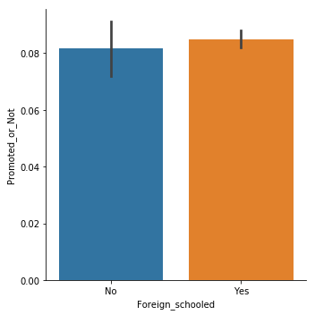

## Importing Necessary Libraries and Loading the Dataset


```python
import pandas as pd
import numpy as np
import matplotlib.pyplot as plt
import seaborn as sns
```


```python
df_train=pd.read_csv('/kaggle/input/intercampusai2019/train.csv')
df_test=pd.read_csv('/kaggle/input/intercampusai2019/test.csv')
sample=pd.read_csv('/kaggle/input/intercampusai2019/sample_submission2.csv')
```

# Viewing the data


```python
df_train.describe()
```


<div>
<style scoped>
    .dataframe tbody tr th:only-of-type {
        vertical-align: middle;
    }

    .dataframe tbody tr th {
        vertical-align: top;
    }

    .dataframe thead th {
        text-align: right;
    }
</style>
<table border="1" class="dataframe">
  <thead>
    <tr style="text-align: right;">
      <th></th>
      <th>Trainings_Attended</th>
      <th>Year_of_birth</th>
      <th>Last_performance_score</th>
      <th>Year_of_recruitment</th>
      <th>Targets_met</th>
      <th>Previous_Award</th>
      <th>Training_score_average</th>
      <th>Promoted_or_Not</th>
    </tr>
  </thead>
  <tbody>
    <tr>
      <td>count</td>
      <td>38312.000000</td>
      <td>38312.000000</td>
      <td>38312.000000</td>
      <td>38312.000000</td>
      <td>38312.000000</td>
      <td>38312.000000</td>
      <td>38312.000000</td>
      <td>38312.000000</td>
    </tr>
    <tr>
      <td>mean</td>
      <td>2.253680</td>
      <td>1986.209334</td>
      <td>7.698959</td>
      <td>2013.139695</td>
      <td>0.352996</td>
      <td>0.023152</td>
      <td>55.366465</td>
      <td>0.084595</td>
    </tr>
    <tr>
      <td>std</td>
      <td>0.609443</td>
      <td>7.646047</td>
      <td>3.744135</td>
      <td>4.261451</td>
      <td>0.477908</td>
      <td>0.150388</td>
      <td>13.362741</td>
      <td>0.278282</td>
    </tr>
    <tr>
      <td>min</td>
      <td>2.000000</td>
      <td>1950.000000</td>
      <td>0.000000</td>
      <td>1982.000000</td>
      <td>0.000000</td>
      <td>0.000000</td>
      <td>31.000000</td>
      <td>0.000000</td>
    </tr>
    <tr>
      <td>25%</td>
      <td>2.000000</td>
      <td>1982.000000</td>
      <td>5.000000</td>
      <td>2012.000000</td>
      <td>0.000000</td>
      <td>0.000000</td>
      <td>43.000000</td>
      <td>0.000000</td>
    </tr>
    <tr>
      <td>50%</td>
      <td>2.000000</td>
      <td>1988.000000</td>
      <td>7.500000</td>
      <td>2014.000000</td>
      <td>0.000000</td>
      <td>0.000000</td>
      <td>52.000000</td>
      <td>0.000000</td>
    </tr>
    <tr>
      <td>75%</td>
      <td>2.000000</td>
      <td>1992.000000</td>
      <td>10.000000</td>
      <td>2016.000000</td>
      <td>1.000000</td>
      <td>0.000000</td>
      <td>68.000000</td>
      <td>0.000000</td>
    </tr>
    <tr>
      <td>max</td>
      <td>11.000000</td>
      <td>2001.000000</td>
      <td>12.500000</td>
      <td>2018.000000</td>
      <td>1.000000</td>
      <td>1.000000</td>
      <td>91.000000</td>
      <td>1.000000</td>
    </tr>
  </tbody>
</table>
</div>


```python
df_train.shape
```


    (38312, 19)


```python
df_train.columns
```


    Index(['EmployeeNo', 'Division', 'Qualification', 'Gender',
           'Channel_of_Recruitment', 'Trainings_Attended', 'Year_of_birth',
           'Last_performance_score', 'Year_of_recruitment', 'Targets_met',
           'Previous_Award', 'Training_score_average', 'State_Of_Origin',
           'Foreign_schooled', 'Marital_Status', 'Past_Disciplinary_Action',
           'Previous_IntraDepartmental_Movement', 'No_of_previous_employers',
           'Promoted_or_Not'],
          dtype='object')


```python
cat_cols=['Division', 'Qualification', 'Gender', 'Channel_of_Recruitment', 'Previous_Award', 'State_Of_Origin',
         'Foreign_schooled', 'Marital_Status',  'Past_Disciplinary_Action', 'Previous_IntraDepartmental_Movement']

def count_unique(df, cols):
    for col in cols:
        print('\n' + 'For column ' + col)
        print(df[col].value_counts())
        
count_unique(df_train, cat_cols)
```

    
    For column Division
    Commercial Sales and Marketing                 11695
    Customer Support and Field Operations           7973
    Sourcing and Purchasing                         5052
    Information Technology and Solution Support     4952
    Information and Strategy                        3721
    Business Finance Operations                     1786
    People/HR Management                            1704
    Regulatory and Legal services                    733
    Research and Innovation                          696
    Name: Division, dtype: int64
    
    For column Qualification
    First Degree or HND         25578
    MSc, MBA and PhD            10469
    Non-University Education      586
    Name: Qualification, dtype: int64
    
    For column Gender
    Male      26880
    Female    11432
    Name: Gender, dtype: int64
    
    For column Channel_of_Recruitment
    Agency and others                  21310
    Direct Internal process            16194
    Referral and Special candidates      808
    Name: Channel_of_Recruitment, dtype: int64
    
    For column Previous_Award
    0    37425
    1      887
    Name: Previous_Award, dtype: int64
    
    For column State_Of_Origin
    LAGOS          6204
    FCT            2389
    OGUN           2302
    RIVERS         2222
    ANAMBRA        1710
    KANO           1649
    DELTA          1594
    OYO            1508
    KADUNA         1399
    IMO            1307
    EDO            1259
    ENUGU          1025
    ABIA            950
    OSUN            929
    ONDO            875
    NIGER           857
    KWARA           765
    PLATEAU         739
    AKWA IBOM       673
    NASSARAWA       632
    KATSINA         615
    ADAMAWA         605
    BENUE           579
    BAUCHI          557
    KOGI            542
    SOKOTO          499
    CROSS RIVER     495
    EKITI           455
    BORNO           447
    TARABA          400
    KEBBI           393
    BAYELSA         324
    EBONYI          313
    GOMBE           291
    ZAMFARA         290
    JIGAWA          262
    YOBE            257
    Name: State_Of_Origin, dtype: int64
    
    For column Foreign_schooled
    Yes    34995
    No      3317
    Name: Foreign_schooled, dtype: int64
    
    For column Marital_Status
    Married     31022
    Single       6927
    Not_Sure      363
    Name: Marital_Status, dtype: int64
    
    For column Past_Disciplinary_Action
    No     38161
    Yes      151
    Name: Past_Disciplinary_Action, dtype: int64
    
    For column Previous_IntraDepartmental_Movement
    No     34709
    Yes     3603
    Name: Previous_IntraDepartmental_Movement, dtype: int64
    


```python
df_test.head(5)
```


<div>
<style scoped>
    .dataframe tbody tr th:only-of-type {
        vertical-align: middle;
    }

    .dataframe tbody tr th {
        vertical-align: top;
    }

    .dataframe thead th {
        text-align: right;
    }
</style>
<table border="1" class="dataframe">
  <thead>
    <tr style="text-align: right;">
      <th></th>
      <th>EmployeeNo</th>
      <th>Division</th>
      <th>Qualification</th>
      <th>Gender</th>
      <th>Channel_of_Recruitment</th>
      <th>Trainings_Attended</th>
      <th>Year_of_birth</th>
      <th>Last_performance_score</th>
      <th>Year_of_recruitment</th>
      <th>Targets_met</th>
      <th>Previous_Award</th>
      <th>Training_score_average</th>
      <th>State_Of_Origin</th>
      <th>Foreign_schooled</th>
      <th>Marital_Status</th>
      <th>Past_Disciplinary_Action</th>
      <th>Previous_IntraDepartmental_Movement</th>
      <th>No_of_previous_employers</th>
    </tr>
  </thead>
  <tbody>
    <tr>
      <td>0</td>
      <td>YAK/S/00005</td>
      <td>Information Technology and Solution Support</td>
      <td>First Degree or HND</td>
      <td>Male</td>
      <td>Agency and others</td>
      <td>2</td>
      <td>1976</td>
      <td>7.5</td>
      <td>2017</td>
      <td>0</td>
      <td>0</td>
      <td>65</td>
      <td>FCT</td>
      <td>Yes</td>
      <td>Married</td>
      <td>No</td>
      <td>No</td>
      <td>1</td>
    </tr>
    <tr>
      <td>1</td>
      <td>YAK/S/00011</td>
      <td>Information Technology and Solution Support</td>
      <td>NaN</td>
      <td>Male</td>
      <td>Direct Internal process</td>
      <td>2</td>
      <td>1991</td>
      <td>0.0</td>
      <td>2018</td>
      <td>0</td>
      <td>0</td>
      <td>69</td>
      <td>OGUN</td>
      <td>Yes</td>
      <td>Married</td>
      <td>No</td>
      <td>No</td>
      <td>1</td>
    </tr>
    <tr>
      <td>2</td>
      <td>YAK/S/00015</td>
      <td>Research and Innovation</td>
      <td>MSc, MBA and PhD</td>
      <td>Male</td>
      <td>Direct Internal process</td>
      <td>2</td>
      <td>1984</td>
      <td>7.5</td>
      <td>2012</td>
      <td>0</td>
      <td>0</td>
      <td>76</td>
      <td>KANO</td>
      <td>Yes</td>
      <td>Married</td>
      <td>No</td>
      <td>No</td>
      <td>1</td>
    </tr>
    <tr>
      <td>3</td>
      <td>YAK/S/00016</td>
      <td>Customer Support and Field Operations</td>
      <td>First Degree or HND</td>
      <td>Male</td>
      <td>Agency and others</td>
      <td>2</td>
      <td>1984</td>
      <td>2.5</td>
      <td>2009</td>
      <td>0</td>
      <td>0</td>
      <td>52</td>
      <td>RIVERS</td>
      <td>No</td>
      <td>Single</td>
      <td>No</td>
      <td>No</td>
      <td>1</td>
    </tr>
    <tr>
      <td>4</td>
      <td>YAK/S/00017</td>
      <td>Information Technology and Solution Support</td>
      <td>First Degree or HND</td>
      <td>Male</td>
      <td>Agency and others</td>
      <td>2</td>
      <td>1983</td>
      <td>7.5</td>
      <td>2014</td>
      <td>1</td>
      <td>0</td>
      <td>69</td>
      <td>FCT</td>
      <td>Yes</td>
      <td>Married</td>
      <td>No</td>
      <td>No</td>
      <td>0</td>
    </tr>
  </tbody>
</table>
</div>


```python
df_test.shape
```


    (16496, 18)


```python
df_train.info()
```

    <class 'pandas.core.frame.DataFrame'>
    RangeIndex: 38312 entries, 0 to 38311
    Data columns (total 19 columns):
    EmployeeNo                             38312 non-null object
    Division                               38312 non-null object
    Qualification                          36633 non-null object
    Gender                                 38312 non-null object
    Channel_of_Recruitment                 38312 non-null object
    Trainings_Attended                     38312 non-null int64
    Year_of_birth                          38312 non-null int64
    Last_performance_score                 38312 non-null float64
    Year_of_recruitment                    38312 non-null int64
    Targets_met                            38312 non-null int64
    Previous_Award                         38312 non-null int64
    Training_score_average                 38312 non-null int64
    State_Of_Origin                        38312 non-null object
    Foreign_schooled                       38312 non-null object
    Marital_Status                         38312 non-null object
    Past_Disciplinary_Action               38312 non-null object
    Previous_IntraDepartmental_Movement    38312 non-null object
    No_of_previous_employers               38312 non-null object
    Promoted_or_Not                        38312 non-null int64
    dtypes: float64(1), int64(7), object(11)
    memory usage: 5.6+ MB
    


```python
df_test.info()
```

    <class 'pandas.core.frame.DataFrame'>
    RangeIndex: 16496 entries, 0 to 16495
    Data columns (total 18 columns):
    EmployeeNo                             16496 non-null object
    Division                               16496 non-null object
    Qualification                          15766 non-null object
    Gender                                 16496 non-null object
    Channel_of_Recruitment                 16496 non-null object
    Trainings_Attended                     16496 non-null int64
    Year_of_birth                          16496 non-null int64
    Last_performance_score                 16496 non-null float64
    Year_of_recruitment                    16496 non-null int64
    Targets_met                            16496 non-null int64
    Previous_Award                         16496 non-null int64
    Training_score_average                 16496 non-null int64
    State_Of_Origin                        16496 non-null object
    Foreign_schooled                       16496 non-null object
    Marital_Status                         16496 non-null object
    Past_Disciplinary_Action               16496 non-null object
    Previous_IntraDepartmental_Movement    16496 non-null object
    No_of_previous_employers               16496 non-null object
    dtypes: float64(1), int64(6), object(11)
    memory usage: 2.3+ MB
    

From the above we can observe that the Qualification rows has some missing values


```python
df_train.describe(include=[np.object, pd.Categorical]).T
```


<div>
<style scoped>
    .dataframe tbody tr th:only-of-type {
        vertical-align: middle;
    }

    .dataframe tbody tr th {
        vertical-align: top;
    }

    .dataframe thead th {
        text-align: right;
    }
</style>
<table border="1" class="dataframe">
  <thead>
    <tr style="text-align: right;">
      <th></th>
      <th>count</th>
      <th>unique</th>
      <th>top</th>
      <th>freq</th>
    </tr>
  </thead>
  <tbody>
    <tr>
      <td>EmployeeNo</td>
      <td>38312</td>
      <td>38312</td>
      <td>YAK/S/21678</td>
      <td>1</td>
    </tr>
    <tr>
      <td>Division</td>
      <td>38312</td>
      <td>9</td>
      <td>Commercial Sales and Marketing</td>
      <td>11695</td>
    </tr>
    <tr>
      <td>Qualification</td>
      <td>36633</td>
      <td>3</td>
      <td>First Degree or HND</td>
      <td>25578</td>
    </tr>
    <tr>
      <td>Gender</td>
      <td>38312</td>
      <td>2</td>
      <td>Male</td>
      <td>26880</td>
    </tr>
    <tr>
      <td>Channel_of_Recruitment</td>
      <td>38312</td>
      <td>3</td>
      <td>Agency and others</td>
      <td>21310</td>
    </tr>
    <tr>
      <td>State_Of_Origin</td>
      <td>38312</td>
      <td>37</td>
      <td>LAGOS</td>
      <td>6204</td>
    </tr>
    <tr>
      <td>Foreign_schooled</td>
      <td>38312</td>
      <td>2</td>
      <td>Yes</td>
      <td>34995</td>
    </tr>
    <tr>
      <td>Marital_Status</td>
      <td>38312</td>
      <td>3</td>
      <td>Married</td>
      <td>31022</td>
    </tr>
    <tr>
      <td>Past_Disciplinary_Action</td>
      <td>38312</td>
      <td>2</td>
      <td>No</td>
      <td>38161</td>
    </tr>
    <tr>
      <td>Previous_IntraDepartmental_Movement</td>
      <td>38312</td>
      <td>2</td>
      <td>No</td>
      <td>34709</td>
    </tr>
    <tr>
      <td>No_of_previous_employers</td>
      <td>38312</td>
      <td>7</td>
      <td>1</td>
      <td>18867</td>
    </tr>
  </tbody>
</table>
</div>


## Performing Exploratory Data Analysis


```python
def plot_bars(df, cols):
    for col in cols:
        fig = plt.figure(figsize=(6,6)) # define plot area
        ax = fig.gca() # define axis
        counts = df[col].value_counts() # find the counts for each unique categor
        counts.plot.bar(ax = ax, color = 'blue') # Use the plot.bar method on the
        ax.set_title(col) # Give the plot a main title
        ax.set_xlabel('Count by' + col) # Set text for the x axis
        ax.set_ylabel('Count')# Set text for y axis
        plt.show()
        
plot_bars(df_train, cat_cols)
```


From the charts above, we can see that a lot of the counts are imbalanced. This may have an influence of our modelling.


```python
sns.catplot(x='Gender', y='Promoted_or_Not',kind="bar", data=df_train)
```


    <seaborn.axisgrid.FacetGrid at 0x7f45ebc56a20>


There seem to be no gender bias in promotion


```python
sns.catplot(x='Foreign_schooled', y='Promoted_or_Not',kind="bar", data=df_train)
```


    <seaborn.axisgrid.FacetGrid at 0x7f45ebc28e48>





Location of school also seems to not be a huge factor


```python
sns.catplot(x='Previous_Award', y='Promoted_or_Not',kind="bar", data=df_train)
```


    <seaborn.axisgrid.FacetGrid at 0x7f45ebbc5470>


Previous award is a major factor in getting promoted. This is reasonable as awards are generally accompanied with promotions due to excellent work done.


```python
sns.catplot(x='Past_Disciplinary_Action', y='Promoted_or_Not',kind="bar", data=df_train)
```


    <seaborn.axisgrid.FacetGrid at 0x7f45eb79d828>


Whether or not you have had a disciplinary case seem not to be a major factor (notice the error bars)


```python
sns.catplot(y='Channel_of_Recruitment', x='Promoted_or_Not',kind="bar", data=df_train)
```


    <seaborn.axisgrid.FacetGrid at 0x7f45ebab09e8>


So from this, referral candidates seems to have better chance of being promoted. This may mean some sort of bias is present.


```python
sns.catplot(y='Qualification', x='Promoted_or_Not',kind="bar", data=df_train)
```


    <seaborn.axisgrid.FacetGrid at 0x7f45eb853dd8>


Interesting enough, level of education does not seem to be a major factor too


```python
sns.catplot(y='Targets_met', x='Promoted_or_Not',kind="bar", data=df_train)
```


    <seaborn.axisgrid.FacetGrid at 0x7f45ebb09e80>


It seems like high achievers (those who meet their targets) are usually promoted which is a good thing.

## Feature Engineering


```python
dataset=[df_train, df_test]
for data in dataset:
    data['Age']= 2019-data['Year_of_birth']
    
df_train.head(5)
```


<div>
<style scoped>
    .dataframe tbody tr th:only-of-type {
        vertical-align: middle;
    }

    .dataframe tbody tr th {
        vertical-align: top;
    }

    .dataframe thead th {
        text-align: right;
    }
</style>
<table border="1" class="dataframe">
  <thead>
    <tr style="text-align: right;">
      <th></th>
      <th>EmployeeNo</th>
      <th>Division</th>
      <th>Qualification</th>
      <th>Gender</th>
      <th>Channel_of_Recruitment</th>
      <th>Trainings_Attended</th>
      <th>Year_of_birth</th>
      <th>Last_performance_score</th>
      <th>Year_of_recruitment</th>
      <th>Targets_met</th>
      <th>Previous_Award</th>
      <th>Training_score_average</th>
      <th>State_Of_Origin</th>
      <th>Foreign_schooled</th>
      <th>Marital_Status</th>
      <th>Past_Disciplinary_Action</th>
      <th>Previous_IntraDepartmental_Movement</th>
      <th>No_of_previous_employers</th>
      <th>Promoted_or_Not</th>
      <th>Age</th>
    </tr>
  </thead>
  <tbody>
    <tr>
      <td>0</td>
      <td>YAK/S/00001</td>
      <td>Commercial Sales and Marketing</td>
      <td>MSc, MBA and PhD</td>
      <td>Female</td>
      <td>Direct Internal process</td>
      <td>2</td>
      <td>1986</td>
      <td>12.5</td>
      <td>2011</td>
      <td>1</td>
      <td>0</td>
      <td>41</td>
      <td>ANAMBRA</td>
      <td>No</td>
      <td>Married</td>
      <td>No</td>
      <td>No</td>
      <td>0</td>
      <td>0</td>
      <td>33</td>
    </tr>
    <tr>
      <td>1</td>
      <td>YAK/S/00002</td>
      <td>Customer Support and Field Operations</td>
      <td>First Degree or HND</td>
      <td>Male</td>
      <td>Agency and others</td>
      <td>2</td>
      <td>1991</td>
      <td>12.5</td>
      <td>2015</td>
      <td>0</td>
      <td>0</td>
      <td>52</td>
      <td>ANAMBRA</td>
      <td>Yes</td>
      <td>Married</td>
      <td>No</td>
      <td>No</td>
      <td>0</td>
      <td>0</td>
      <td>28</td>
    </tr>
    <tr>
      <td>2</td>
      <td>YAK/S/00003</td>
      <td>Commercial Sales and Marketing</td>
      <td>First Degree or HND</td>
      <td>Male</td>
      <td>Direct Internal process</td>
      <td>2</td>
      <td>1987</td>
      <td>7.5</td>
      <td>2012</td>
      <td>0</td>
      <td>0</td>
      <td>42</td>
      <td>KATSINA</td>
      <td>Yes</td>
      <td>Married</td>
      <td>No</td>
      <td>No</td>
      <td>0</td>
      <td>0</td>
      <td>32</td>
    </tr>
    <tr>
      <td>3</td>
      <td>YAK/S/00004</td>
      <td>Commercial Sales and Marketing</td>
      <td>First Degree or HND</td>
      <td>Male</td>
      <td>Agency and others</td>
      <td>3</td>
      <td>1982</td>
      <td>2.5</td>
      <td>2009</td>
      <td>0</td>
      <td>0</td>
      <td>42</td>
      <td>NIGER</td>
      <td>Yes</td>
      <td>Single</td>
      <td>No</td>
      <td>No</td>
      <td>1</td>
      <td>0</td>
      <td>37</td>
    </tr>
    <tr>
      <td>4</td>
      <td>YAK/S/00006</td>
      <td>Information and Strategy</td>
      <td>First Degree or HND</td>
      <td>Male</td>
      <td>Direct Internal process</td>
      <td>3</td>
      <td>1990</td>
      <td>7.5</td>
      <td>2012</td>
      <td>0</td>
      <td>0</td>
      <td>77</td>
      <td>AKWA IBOM</td>
      <td>Yes</td>
      <td>Married</td>
      <td>No</td>
      <td>No</td>
      <td>1</td>
      <td>0</td>
      <td>29</td>
    </tr>
  </tbody>
</table>
</div>


```python
print("The shape of the train", df_train.shape)
print("The shape of the test", df_test.shape)
```

    The shape of the train (38312, 20)
    The shape of the test (16496, 19)
    


```python
dataset=[df_train, df_test]
for data in dataset:
    data['No_of_years_at_work']= 2019-data['Year_of_recruitment']
    
df_train.head(5)
```


<div>
<style scoped>
    .dataframe tbody tr th:only-of-type {
        vertical-align: middle;
    }

    .dataframe tbody tr th {
        vertical-align: top;
    }

    .dataframe thead th {
        text-align: right;
    }
</style>
<table border="1" class="dataframe">
  <thead>
    <tr style="text-align: right;">
      <th></th>
      <th>EmployeeNo</th>
      <th>Division</th>
      <th>Qualification</th>
      <th>Gender</th>
      <th>Channel_of_Recruitment</th>
      <th>Trainings_Attended</th>
      <th>Year_of_birth</th>
      <th>Last_performance_score</th>
      <th>Year_of_recruitment</th>
      <th>Targets_met</th>
      <th>...</th>
      <th>Training_score_average</th>
      <th>State_Of_Origin</th>
      <th>Foreign_schooled</th>
      <th>Marital_Status</th>
      <th>Past_Disciplinary_Action</th>
      <th>Previous_IntraDepartmental_Movement</th>
      <th>No_of_previous_employers</th>
      <th>Promoted_or_Not</th>
      <th>Age</th>
      <th>No_of_years_at_work</th>
    </tr>
  </thead>
  <tbody>
    <tr>
      <td>0</td>
      <td>YAK/S/00001</td>
      <td>Commercial Sales and Marketing</td>
      <td>MSc, MBA and PhD</td>
      <td>Female</td>
      <td>Direct Internal process</td>
      <td>2</td>
      <td>1986</td>
      <td>12.5</td>
      <td>2011</td>
      <td>1</td>
      <td>...</td>
      <td>41</td>
      <td>ANAMBRA</td>
      <td>No</td>
      <td>Married</td>
      <td>No</td>
      <td>No</td>
      <td>0</td>
      <td>0</td>
      <td>33</td>
      <td>8</td>
    </tr>
    <tr>
      <td>1</td>
      <td>YAK/S/00002</td>
      <td>Customer Support and Field Operations</td>
      <td>First Degree or HND</td>
      <td>Male</td>
      <td>Agency and others</td>
      <td>2</td>
      <td>1991</td>
      <td>12.5</td>
      <td>2015</td>
      <td>0</td>
      <td>...</td>
      <td>52</td>
      <td>ANAMBRA</td>
      <td>Yes</td>
      <td>Married</td>
      <td>No</td>
      <td>No</td>
      <td>0</td>
      <td>0</td>
      <td>28</td>
      <td>4</td>
    </tr>
    <tr>
      <td>2</td>
      <td>YAK/S/00003</td>
      <td>Commercial Sales and Marketing</td>
      <td>First Degree or HND</td>
      <td>Male</td>
      <td>Direct Internal process</td>
      <td>2</td>
      <td>1987</td>
      <td>7.5</td>
      <td>2012</td>
      <td>0</td>
      <td>...</td>
      <td>42</td>
      <td>KATSINA</td>
      <td>Yes</td>
      <td>Married</td>
      <td>No</td>
      <td>No</td>
      <td>0</td>
      <td>0</td>
      <td>32</td>
      <td>7</td>
    </tr>
    <tr>
      <td>3</td>
      <td>YAK/S/00004</td>
      <td>Commercial Sales and Marketing</td>
      <td>First Degree or HND</td>
      <td>Male</td>
      <td>Agency and others</td>
      <td>3</td>
      <td>1982</td>
      <td>2.5</td>
      <td>2009</td>
      <td>0</td>
      <td>...</td>
      <td>42</td>
      <td>NIGER</td>
      <td>Yes</td>
      <td>Single</td>
      <td>No</td>
      <td>No</td>
      <td>1</td>
      <td>0</td>
      <td>37</td>
      <td>10</td>
    </tr>
    <tr>
      <td>4</td>
      <td>YAK/S/00006</td>
      <td>Information and Strategy</td>
      <td>First Degree or HND</td>
      <td>Male</td>
      <td>Direct Internal process</td>
      <td>3</td>
      <td>1990</td>
      <td>7.5</td>
      <td>2012</td>
      <td>0</td>
      <td>...</td>
      <td>77</td>
      <td>AKWA IBOM</td>
      <td>Yes</td>
      <td>Married</td>
      <td>No</td>
      <td>No</td>
      <td>1</td>
      <td>0</td>
      <td>29</td>
      <td>7</td>
    </tr>
  </tbody>
</table>
<p>5 rows × 21 columns</p>
</div>


Removing outliers from dataset


```python
def outlier_gaus(data,col):
    Upper_boundary = data[col].mean() + 3*data[col].std()
    Lower_boundary = data[col].mean() - 3*data[col].std()
    
    return Upper_boundary, Lower_boundary
    
def outlier_IQR(data, col):
    IQR = data[col].quantile(0.75) - data[col].quantile(0.25)
    Lower_fence = data[col].quantile(0.25) - (IQR * 3)
    Upper_fence = data[col].quantile(0.75) + (IQR * 3)
    
    return Upper_fence, Lower_fence
```


```python
Age_upper_limit, Age_lower = outlier_gaus(df_train, 'Age')
years_recruit_upper, years_recruit_lower = outlier_IQR(df_train, 'No_of_years_at_work')
train_score_upper, train_score_lower = outlier_IQR(df_train, 'Training_score_average')
```


```python
dataset = [df_train, df_test]

for data in dataset:
    data['Age'] = np.where(data['Age'] > Age_upper_limit, Age_upper_limit,
                          np.where(data['Age'] < Age_lower, Age_lower, data['Age']))
    data['No_of_years_at_work'] = np.where(data['No_of_years_at_work'] > years_recruit_upper, years_recruit_upper,
                                          np.where(data['No_of_years_at_work'] < years_recruit_lower, years_recruit_lower, data['No_of_years_at_work']))
    data['Training_score_average'] = np.where(data['Training_score_average'] > train_score_upper, train_score_upper,
                                             np.where(data['Training_score_average'] < train_score_lower, train_score_lower, data['Training_score_average']))

```

Using some domain knowledge to map states to regional zones


```python
dataset = [df_train, df_test]
zones = {'LAGOS':"SW","FCT":"NC", "OGUN":"SW","RIVERS":"SS", "ANAMBRA":"SE","KANO":"NW", "DELTA":"SS", "OYO":"SW", 
         "KADUNA":"NW","IMO":"SE", "EDO":"SS", "ENUGU":"SE", "ABIA":"SE", "OSUN":"SW","ONDO":"SW", "NIGER":"NC", 
         "KWARA":"NC", "PLATEAU":"NC", "AKWA IBOM":"SS", "NASSARAWA":"NC", "KATSINA":"NW", "ADAMAWA":"NE","BENUE":"NC",
         "BAUCHI":"NE", "KOGI":"NC", "SOKOTO":"NW", "CROSS RIVER":"SS", "EKITI":"SW", "BORNO":"NE", "TARABA":"NE",
         "KEBBI":"NW", "BAYELSA":"SS", "EBONYI":"SE", "GOMBE":"NE", "ZAMFARA":"NW","JIGAWA":"NW", "YOBE":"NE"}
for data in dataset:
    data['Zones']=data['State_Of_Origin'].replace(zones)
    
df_train.head(5)
```


<div>
<style scoped>
    .dataframe tbody tr th:only-of-type {
        vertical-align: middle;
    }

    .dataframe tbody tr th {
        vertical-align: top;
    }

    .dataframe thead th {
        text-align: right;
    }
</style>
<table border="1" class="dataframe">
  <thead>
    <tr style="text-align: right;">
      <th></th>
      <th>EmployeeNo</th>
      <th>Division</th>
      <th>Qualification</th>
      <th>Gender</th>
      <th>Channel_of_Recruitment</th>
      <th>Trainings_Attended</th>
      <th>Year_of_birth</th>
      <th>Last_performance_score</th>
      <th>Year_of_recruitment</th>
      <th>Targets_met</th>
      <th>...</th>
      <th>State_Of_Origin</th>
      <th>Foreign_schooled</th>
      <th>Marital_Status</th>
      <th>Past_Disciplinary_Action</th>
      <th>Previous_IntraDepartmental_Movement</th>
      <th>No_of_previous_employers</th>
      <th>Promoted_or_Not</th>
      <th>Age</th>
      <th>No_of_years_at_work</th>
      <th>Zones</th>
    </tr>
  </thead>
  <tbody>
    <tr>
      <td>0</td>
      <td>YAK/S/00001</td>
      <td>Commercial Sales and Marketing</td>
      <td>MSc, MBA and PhD</td>
      <td>Female</td>
      <td>Direct Internal process</td>
      <td>2</td>
      <td>1986</td>
      <td>12.5</td>
      <td>2011</td>
      <td>1</td>
      <td>...</td>
      <td>ANAMBRA</td>
      <td>No</td>
      <td>Married</td>
      <td>No</td>
      <td>No</td>
      <td>0</td>
      <td>0</td>
      <td>33.0</td>
      <td>8.0</td>
      <td>SE</td>
    </tr>
    <tr>
      <td>1</td>
      <td>YAK/S/00002</td>
      <td>Customer Support and Field Operations</td>
      <td>First Degree or HND</td>
      <td>Male</td>
      <td>Agency and others</td>
      <td>2</td>
      <td>1991</td>
      <td>12.5</td>
      <td>2015</td>
      <td>0</td>
      <td>...</td>
      <td>ANAMBRA</td>
      <td>Yes</td>
      <td>Married</td>
      <td>No</td>
      <td>No</td>
      <td>0</td>
      <td>0</td>
      <td>28.0</td>
      <td>4.0</td>
      <td>SE</td>
    </tr>
    <tr>
      <td>2</td>
      <td>YAK/S/00003</td>
      <td>Commercial Sales and Marketing</td>
      <td>First Degree or HND</td>
      <td>Male</td>
      <td>Direct Internal process</td>
      <td>2</td>
      <td>1987</td>
      <td>7.5</td>
      <td>2012</td>
      <td>0</td>
      <td>...</td>
      <td>KATSINA</td>
      <td>Yes</td>
      <td>Married</td>
      <td>No</td>
      <td>No</td>
      <td>0</td>
      <td>0</td>
      <td>32.0</td>
      <td>7.0</td>
      <td>NW</td>
    </tr>
    <tr>
      <td>3</td>
      <td>YAK/S/00004</td>
      <td>Commercial Sales and Marketing</td>
      <td>First Degree or HND</td>
      <td>Male</td>
      <td>Agency and others</td>
      <td>3</td>
      <td>1982</td>
      <td>2.5</td>
      <td>2009</td>
      <td>0</td>
      <td>...</td>
      <td>NIGER</td>
      <td>Yes</td>
      <td>Single</td>
      <td>No</td>
      <td>No</td>
      <td>1</td>
      <td>0</td>
      <td>37.0</td>
      <td>10.0</td>
      <td>NC</td>
    </tr>
    <tr>
      <td>4</td>
      <td>YAK/S/00006</td>
      <td>Information and Strategy</td>
      <td>First Degree or HND</td>
      <td>Male</td>
      <td>Direct Internal process</td>
      <td>3</td>
      <td>1990</td>
      <td>7.5</td>
      <td>2012</td>
      <td>0</td>
      <td>...</td>
      <td>AKWA IBOM</td>
      <td>Yes</td>
      <td>Married</td>
      <td>No</td>
      <td>No</td>
      <td>1</td>
      <td>0</td>
      <td>29.0</td>
      <td>7.0</td>
      <td>SS</td>
    </tr>
  </tbody>
</table>
<p>5 rows × 22 columns</p>
</div>


```python
df_train['Zones'].value_counts()
```


    SW    12273
    SS     6567
    NC     6503
    SE     5305
    NW     5107
    NE     2557
    Name: Zones, dtype: int64


```python
sns.catplot(y='Zones', x='Promoted_or_Not',kind="bar", data=df_train)
```


    <seaborn.axisgrid.FacetGrid at 0x7f45eb5fa390>


Zone of origin seem not to be a big factor too.

# Taking care of missing values


```python
df_train['Qualification'] = df_train['Qualification'].fillna(method="bfill")
df_test['Qualification'] = df_test['Qualification'].fillna(method="bfill")
```


```python
df_train['No_of_previous_employers'].value_counts()
```


    1              18867
    0              13272
    2               1918
    3               1587
    4               1324
    5                943
    More than 5      401
    Name: No_of_previous_employers, dtype: int64


# Removing features that do not seem to count


```python
del df_train['Year_of_birth']
del df_test['Year_of_birth']
del df_train['Year_of_recruitment']
del df_test['Year_of_recruitment']
del df_test['State_Of_Origin']
del df_train['State_Of_Origin']
```

# Preparing the dataset for modelling


```python
cols= ['Channel_of_Recruitment', 'Division', 'Zones']
target='Promoted_or_Not'

def categories_to_ordered(df, cols, target):
    for col in cols:
        
        #oder categories according to the target mean
        ordered_labels = df_train.groupby([col])[target].mean().sort_values().index
        
        #create the dictionary to map the ordered labels to an ordinal number
        ordinal_label = {k: v for v, k in enumerate (ordered_labels, 0)}
        
        #remap the categories to these ordinal numbers
        df_train[col] = df_train[col].map(ordinal_label)
        df_test[col] =df_train[col].map(ordinal_label)
        
```


```python
categories_to_ordered(df_train, cols, target)
categories_to_ordered(df_test, cols, target)
```


```python
cat_cols=['Gender', 'Previous_Award','Foreign_schooled', 'Marital_Status',  'Qualification',
          'Past_Disciplinary_Action', 'Previous_IntraDepartmental_Movement', 'No_of_previous_employers']

train=pd.get_dummies(df_train, prefix=cat_cols,columns=cat_cols)
test=pd.get_dummies(df_test, prefix=cat_cols, columns=cat_cols)
```


```python
print("This is the shape of the training set ",train.shape)
print("This is the shape of the test set ", test.shape)
```

    This is the shape of the training set  (38312, 34)
    This is the shape of the test set  (16496, 33)
    


```python
del train['EmployeeNo']
del test['EmployeeNo']
```


```python
del train['Promoted_or_Not']
print("This is the shape of the training set ",train.shape)
print("This is the shape of the test set ", test.shape)
```

    This is the shape of the training set  (38312, 32)
    This is the shape of the test set  (16496, 32)
    


```python
df_train['Promoted_or_Not'].value_counts()
```


    0    35071
    1     3241
    Name: Promoted_or_Not, dtype: int64


## Training and Applying Algorithms 


### Splitting Dataset


```python
from sklearn.model_selection import train_test_split
from sklearn.linear_model import LogisticRegression
from sklearn.ensemble import RandomForestClassifier, GradientBoostingClassifier
from sklearn.neural_network import MLPClassifier
import sklearn.metrics as sklm
from math import sqrt
```


```python
feature=train.columns
target=['Promoted_or_Not']
X=train[feature].values
y=df_train[target].values 
split_test_size=0.30
X_train, X_test, y_train, y_test= train_test_split(X,y, test_size=split_test_size, random_state=42)
```


```python
print("{0:0.2f}% in training set".format((len(X_train)/len(train.index)) * 100))
print("{0:0.2f}% in test set".format((len(X_test)/len(train.index)) * 100))
```

    70.00% in training set
    30.00% in test set
    


```python
from sklearn.preprocessing import RobustScaler
ss=RobustScaler()
X_train=ss.fit_transform(X_train)
X_test=ss.transform(X_test)
test1= ss.transform(test)
```

### Handling Imbalanced Dataset


```python
from imblearn.over_sampling import SMOTE

smote = SMOTE(ratio='minority')
X_train, y_train = smote.fit_sample(X_train, y_train)
```

    Using TensorFlow backend.
    /opt/conda/lib/python3.6/site-packages/sklearn/utils/validation.py:724: DataConversionWarning: A column-vector y was passed when a 1d array was expected. Please change the shape of y to (n_samples, ), for example using ravel().
      y = column_or_1d(y, warn=True)
    

### Logistic Regression


```python
#Logistic Regression without parameter tuning
lr = LogisticRegression()
lr.fit(X_train, y_train)
```

    /opt/conda/lib/python3.6/site-packages/sklearn/linear_model/logistic.py:432: FutureWarning: Default solver will be changed to 'lbfgs' in 0.22. Specify a solver to silence this warning.
      FutureWarning)
    


    LogisticRegression(C=1.0, class_weight=None, dual=False, fit_intercept=True,
                       intercept_scaling=1, l1_ratio=None, max_iter=100,
                       multi_class='warn', n_jobs=None, penalty='l2',
                       random_state=None, solver='warn', tol=0.0001, verbose=0,
                       warm_start=False)


```python
def plot_auc(labels, probs):
    ## Compute the false positive rate, true positive rate
    ## and threshold along with the AUC
    fpr, tpr, threshold = sklm.roc_curve(labels, probs[:,1])
    auc = sklm.auc(fpr, tpr)
    
    ## Plot the result
    plt.title('Receiver Operating Characteristic')
    plt.plot(fpr, tpr, color = 'blue', label = 'AUC = %0.2f' % auc)
    plt.legend(loc = 'lower right')
    plt.plot([0, 1], [0, 1],'r--')
    plt.xlim([0, 1])
    plt.ylim([0, 1])
    plt.ylabel('True Positive Rate')
    plt.xlabel('False Positive Rate')
    plt.show()
```


```python
probabilities = lr.predict_proba(X_test)

def score_model(probs, threshold):
    return np.array([1 if x > threshold else 0 for x in probs[:,1]])

def print_metrics(labels, probs, threshold):
    scores = score_model(probs, threshold)
    metrics = sklm.precision_recall_fscore_support(labels, scores)
    conf = sklm.confusion_matrix(labels, scores)
    print('                 Confusion matrix')
    print('                 Score positive    Score negative')
    print('Actual positive    %6d' % conf[0,0] + '             %5d' % conf[0,1])
    print('Actual negative    %6d' % conf[1,0] + '             %5d' % conf[1,1])
    print('')
    print('Accuracy        %0.2f' % sklm.accuracy_score(labels, scores))
    print('AUC             %0.2f' % sklm.roc_auc_score(labels, probs[:,1]))
    print('Macro precision %0.2f' % float((float(metrics[0][0]) + float(metrics[0][1]))/2.0))
    print('Macro recall    %0.2f' % float((float(metrics[1][0]) + float(metrics[1][1]))/2.0))
    print(' ')
    print('           Positive      Negative')
    print('Num case   %6d' % metrics[3][0] + '        %6d' % metrics[3][1])
    print('Precision  %6.2f' % metrics[0][0] + '        %6.2f' % metrics[0][1])
    print('Recall     %6.2f' % metrics[1][0] + '        %6.2f' % metrics[1][1])
    print('F1         %6.2f' % metrics[2][0] + '        %6.2f' % metrics[2][1])
    

print_metrics(y_test, probabilities, 0.5)
```

                     Confusion matrix
                     Score positive    Score negative
    Actual positive      7290              3229
    Actual negative       254               721
    
    Accuracy        0.70
    AUC             0.81
    Macro precision 0.57
    Macro recall    0.72
     
               Positive      Negative
    Num case    10519           975
    Precision    0.97          0.18
    Recall       0.69          0.74
    F1           0.81          0.29
    


```python
probabilities = lr.predict_proba(X_train)
print_metrics(y_train, probabilities, 0.5)
```

                     Confusion matrix
                     Score positive    Score negative
    Actual positive     17095              7457
    Actual negative      5893             18659
    
    Accuracy        0.73
    AUC             0.82
    Macro precision 0.73
    Macro recall    0.73
     
               Positive      Negative
    Num case    24552         24552
    Precision    0.74          0.71
    Recall       0.70          0.76
    F1           0.72          0.74
    


```python
plot_auc(y_train, probabilities)
```


### Gradient Boosting 


```python
gb = GradientBoostingClassifier()
gb.fit(X_train, y_train)
```


    GradientBoostingClassifier(criterion='friedman_mse', init=None,
                               learning_rate=0.1, loss='deviance', max_depth=3,
                               max_features=None, max_leaf_nodes=None,
                               min_impurity_decrease=0.0, min_impurity_split=None,
                               min_samples_leaf=1, min_samples_split=2,
                               min_weight_fraction_leaf=0.0, n_estimators=100,
                               n_iter_no_change=None, presort='auto',
                               random_state=None, subsample=1.0, tol=0.0001,
                               validation_fraction=0.1, verbose=0,
                               warm_start=False)


```python
probabilities = gb.predict_proba(X_train)
print_metrics(y_train, probabilities, 0.5)
```

                     Confusion matrix
                     Score positive    Score negative
    Actual positive     23224              1328
    Actual negative      2066             22486
    
    Accuracy        0.93
    AUC             0.98
    Macro precision 0.93
    Macro recall    0.93
     
               Positive      Negative
    Num case    24552         24552
    Precision    0.92          0.94
    Recall       0.95          0.92
    F1           0.93          0.93
    


```python
probabilities = gb.predict_proba(X_test)
print_metrics(y_test, probabilities, 0.5)
```

                     Confusion matrix
                     Score positive    Score negative
    Actual positive      9932               587
    Actual negative       608               367
    
    Accuracy        0.90
    AUC             0.86
    Macro precision 0.66
    Macro recall    0.66
     
               Positive      Negative
    Num case    10519           975
    Precision    0.94          0.38
    Recall       0.94          0.38
    F1           0.94          0.38
    


```python
plot_auc(y_test, probabilities)
```


```python
gb = GradientBoostingClassifier(max_depth=2, n_estimators=500, max_features='auto', loss='exponential' )
gb.fit(X_train, y_train)
```


    GradientBoostingClassifier(criterion='friedman_mse', init=None,
                               learning_rate=0.1, loss='exponential', max_depth=2,
                               max_features='auto', max_leaf_nodes=None,
                               min_impurity_decrease=0.0, min_impurity_split=None,
                               min_samples_leaf=1, min_samples_split=2,
                               min_weight_fraction_leaf=0.0, n_estimators=500,
                               n_iter_no_change=None, presort='auto',
                               random_state=None, subsample=1.0, tol=0.0001,
                               validation_fraction=0.1, verbose=0,
                               warm_start=False)


```python
probabilities = gb.predict_proba(X_train)
print_metrics(y_train, probabilities, 0.5)
```

                     Confusion matrix
                     Score positive    Score negative
    Actual positive     24345               207
    Actual negative      1815             22737
    
    Accuracy        0.96
    AUC             0.99
    Macro precision 0.96
    Macro recall    0.96
     
               Positive      Negative
    Num case    24552         24552
    Precision    0.93          0.99
    Recall       0.99          0.93
    F1           0.96          0.96
    


```python
probabilities = gb.predict_proba(X_test)
print_metrics(y_test, probabilities, 0.5)
```

                     Confusion matrix
                     Score positive    Score negative
    Actual positive     10438                81
    Actual negative       705               270
    
    Accuracy        0.93
    AUC             0.88
    Macro precision 0.85
    Macro recall    0.63
     
               Positive      Negative
    Num case    10519           975
    Precision    0.94          0.77
    Recall       0.99          0.28
    F1           0.96          0.41
    


```python
plot_auc(y_test, probabilities)
```


```python
fea_imp = pd.DataFrame({'imp': gb.feature_importances_, 'col': feature})
fea_imp = fea_imp.sort_values(['imp', 'col'], ascending=[True, False]).iloc[-1000:]
fea_imp.plot(kind='barh', x='col', y='imp', figsize=(10, 25), legend=None)
plt.title('Gradient Boost - Feature Importance')
plt.ylabel('Features')
plt.xlabel('Importance')
```


    Text(0.5, 0, 'Importance')


```python
import xgboost as xgb
```


```python
xgb=xgb.XGBClassifier(max_depth=3, n_estimators=300, n_jobs=-1)
xgb.fit(X_train, y_train)
```


    XGBClassifier(base_score=0.5, booster='gbtree', colsample_bylevel=1,
                  colsample_bynode=1, colsample_bytree=1, gamma=0,
                  learning_rate=0.1, max_delta_step=0, max_depth=3,
                  min_child_weight=1, missing=None, n_estimators=300, n_jobs=-1,
                  nthread=None, objective='binary:logistic', random_state=0,
                  reg_alpha=0, reg_lambda=1, scale_pos_weight=1, seed=None,
                  silent=None, subsample=1, verbosity=1)


```python
fea_imp = pd.DataFrame({'imp': xgb.feature_importances_, 'col': feature})
fea_imp = fea_imp.sort_values(['imp', 'col'], ascending=[True, False]).iloc[-1000:]
fea_imp.plot(kind='barh', x='col', y='imp', figsize=(10, 25), legend=None)
plt.title('XGBoost - Feature Importance')
plt.ylabel('Features')
plt.xlabel('Importance')
```


    Text(0.5, 0, 'Importance')


```python
probabilities = xgb.predict_proba(X_train)
print_metrics(y_train, probabilities, 0.5)
```

                     Confusion matrix
                     Score positive    Score negative
    Actual positive     24456                96
    Actual negative      1749             22803
    
    Accuracy        0.96
    AUC             0.99
    Macro precision 0.96
    Macro recall    0.96
     
               Positive      Negative
    Num case    24552         24552
    Precision    0.93          1.00
    Recall       1.00          0.93
    F1           0.96          0.96
    


```python
probabilities = xgb.predict_proba(X_test)
print_metrics(y_test, probabilities, 0.5)
```

                     Confusion matrix
                     Score positive    Score negative
    Actual positive     10480                39
    Actual negative       713               262
    
    Accuracy        0.93
    AUC             0.89
    Macro precision 0.90
    Macro recall    0.63
     
               Positive      Negative
    Num case    10519           975
    Precision    0.94          0.87
    Recall       1.00          0.27
    F1           0.97          0.41
    


```python
plot_auc(y_test, probabilities)
```


```python
import xgboost as xgb
xgb=xgb.XGBClassifier(max_depth=3, n_estimators=500, n_jobs=-1)
xgb.fit(X_train, y_train)
```


    XGBClassifier(base_score=0.5, booster='gbtree', colsample_bylevel=1,
                  colsample_bynode=1, colsample_bytree=1, gamma=0,
                  learning_rate=0.1, max_delta_step=0, max_depth=3,
                  min_child_weight=1, missing=None, n_estimators=500, n_jobs=-1,
                  nthread=None, objective='binary:logistic', random_state=0,
                  reg_alpha=0, reg_lambda=1, scale_pos_weight=1, seed=None,
                  silent=None, subsample=1, verbosity=1)


```python
probabilities = xgb.predict_proba(X_train)
print_metrics(y_train, probabilities, 0.5)
```

                     Confusion matrix
                     Score positive    Score negative
    Actual positive     24496                56
    Actual negative      1576             22976
    
    Accuracy        0.97
    AUC             0.99
    Macro precision 0.97
    Macro recall    0.97
     
               Positive      Negative
    Num case    24552         24552
    Precision    0.94          1.00
    Recall       1.00          0.94
    F1           0.97          0.97
    


```python
probabilities = xgb.predict_proba(X_test)
print_metrics(y_test, probabilities, 0.5)
```

                     Confusion matrix
                     Score positive    Score negative
    Actual positive     10489                30
    Actual negative       672               303
    
    Accuracy        0.94
    AUC             0.89
    Macro precision 0.92
    Macro recall    0.65
     
               Positive      Negative
    Num case    10519           975
    Precision    0.94          0.91
    Recall       1.00          0.31
    F1           0.97          0.46
    


```python
plot_auc(y_test, probabilities)
```


```python
from catboost import CatBoostClassifier
```


```python
model = CatBoostClassifier (iterations= 1500, learning_rate=0.1, depth=3, verbose=True)
model.fit(X_train, y_train)
```

    0:	learn: 0.6478614	total: 116ms	remaining: 2m 54s
    1:	learn: 0.6069472	total: 165ms	remaining: 2m 3s
    2:	learn: 0.5839848	total: 214ms	remaining: 1m 46s
    3:	learn: 0.5661845	total: 262ms	remaining: 1m 38s
    4:	learn: 0.5418428	total: 314ms	remaining: 1m 34s
    5:	learn: 0.5296914	total: 364ms	remaining: 1m 30s
    6:	learn: 0.5161046	total: 414ms	remaining: 1m 28s
    7:	learn: 0.4997095	total: 466ms	remaining: 1m 26s
    8:	learn: 0.4798198	total: 520ms	remaining: 1m 26s
    9:	learn: 0.4597044	total: 572ms	remaining: 1m 25s
    10:	learn: 0.4462409	total: 625ms	remaining: 1m 24s
    11:	learn: 0.4413458	total: 678ms	remaining: 1m 24s
    12:	learn: 0.4329582	total: 727ms	remaining: 1m 23s
    13:	learn: 0.4244053	total: 781ms	remaining: 1m 22s
    14:	learn: 0.4188959	total: 826ms	remaining: 1m 21s
    15:	learn: 0.4144758	total: 872ms	remaining: 1m 20s
    16:	learn: 0.4080966	total: 923ms	remaining: 1m 20s
    17:	learn: 0.3991326	total: 973ms	remaining: 1m 20s
    18:	learn: 0.3880273	total: 1.02s	remaining: 1m 19s
    19:	learn: 0.3816793	total: 1.07s	remaining: 1m 19s
    20:	learn: 0.3654948	total: 1.12s	remaining: 1m 19s
    21:	learn: 0.3624465	total: 1.17s	remaining: 1m 18s
    22:	learn: 0.3581670	total: 1.21s	remaining: 1m 18s
    23:	learn: 0.3517500	total: 1.27s	remaining: 1m 17s
    24:	learn: 0.3461288	total: 1.32s	remaining: 1m 17s
    25:	learn: 0.3394091	total: 1.37s	remaining: 1m 17s
    26:	learn: 0.3314313	total: 1.42s	remaining: 1m 17s
    27:	learn: 0.3299654	total: 1.46s	remaining: 1m 16s
    28:	learn: 0.3218761	total: 1.52s	remaining: 1m 16s
    29:	learn: 0.3176345	total: 1.57s	remaining: 1m 16s
    30:	learn: 0.3122921	total: 1.62s	remaining: 1m 16s
    31:	learn: 0.3021806	total: 1.67s	remaining: 1m 16s
    32:	learn: 0.3002728	total: 1.73s	remaining: 1m 16s
    33:	learn: 0.2941854	total: 1.77s	remaining: 1m 16s
    34:	learn: 0.2921204	total: 1.82s	remaining: 1m 16s
    35:	learn: 0.2858609	total: 1.87s	remaining: 1m 15s
    36:	learn: 0.2844681	total: 1.92s	remaining: 1m 15s
    37:	learn: 0.2826736	total: 1.96s	remaining: 1m 15s
    38:	learn: 0.2806742	total: 2.01s	remaining: 1m 15s
    39:	learn: 0.2785829	total: 2.06s	remaining: 1m 15s
    40:	learn: 0.2769017	total: 2.12s	remaining: 1m 15s
    41:	learn: 0.2750815	total: 2.17s	remaining: 1m 15s
    42:	learn: 0.2738048	total: 2.22s	remaining: 1m 15s
    43:	learn: 0.2707800	total: 2.27s	remaining: 1m 15s
    44:	learn: 0.2694802	total: 2.32s	remaining: 1m 14s
    45:	learn: 0.2647292	total: 2.37s	remaining: 1m 15s
    46:	learn: 0.2598010	total: 2.43s	remaining: 1m 15s
    47:	learn: 0.2554613	total: 2.48s	remaining: 1m 15s
    48:	learn: 0.2535296	total: 2.53s	remaining: 1m 15s
    49:	learn: 0.2501880	total: 2.59s	remaining: 1m 14s
    50:	learn: 0.2478267	total: 2.63s	remaining: 1m 14s
    51:	learn: 0.2445940	total: 2.69s	remaining: 1m 14s
    52:	learn: 0.2417615	total: 2.74s	remaining: 1m 14s
    53:	learn: 0.2378065	total: 2.79s	remaining: 1m 14s
    54:	learn: 0.2369166	total: 2.84s	remaining: 1m 14s
    55:	learn: 0.2308421	total: 2.89s	remaining: 1m 14s
    56:	learn: 0.2303736	total: 2.94s	remaining: 1m 14s
    57:	learn: 0.2292571	total: 2.99s	remaining: 1m 14s
    58:	learn: 0.2283744	total: 3.04s	remaining: 1m 14s
    59:	learn: 0.2275540	total: 3.08s	remaining: 1m 14s
    60:	learn: 0.2258699	total: 3.13s	remaining: 1m 13s
    61:	learn: 0.2249704	total: 3.18s	remaining: 1m 13s
    62:	learn: 0.2233831	total: 3.23s	remaining: 1m 13s
    63:	learn: 0.2229389	total: 3.27s	remaining: 1m 13s
    64:	learn: 0.2216449	total: 3.32s	remaining: 1m 13s
    65:	learn: 0.2202730	total: 3.37s	remaining: 1m 13s
    66:	learn: 0.2193511	total: 3.42s	remaining: 1m 13s
    67:	learn: 0.2185668	total: 3.47s	remaining: 1m 13s
    68:	learn: 0.2164973	total: 3.52s	remaining: 1m 13s
    69:	learn: 0.2161886	total: 3.57s	remaining: 1m 12s
    70:	learn: 0.2122233	total: 3.62s	remaining: 1m 12s
    71:	learn: 0.2112781	total: 3.67s	remaining: 1m 12s
    72:	learn: 0.2082970	total: 3.73s	remaining: 1m 12s
    73:	learn: 0.2077295	total: 3.78s	remaining: 1m 12s
    74:	learn: 0.2062108	total: 3.83s	remaining: 1m 12s
    75:	learn: 0.2054756	total: 3.88s	remaining: 1m 12s
    76:	learn: 0.2042947	total: 3.94s	remaining: 1m 12s
    77:	learn: 0.2035662	total: 3.99s	remaining: 1m 12s
    78:	learn: 0.2028597	total: 4.04s	remaining: 1m 12s
    79:	learn: 0.2026634	total: 4.09s	remaining: 1m 12s
    80:	learn: 0.2016837	total: 4.14s	remaining: 1m 12s
    81:	learn: 0.2007243	total: 4.19s	remaining: 1m 12s
    82:	learn: 0.2003752	total: 4.24s	remaining: 1m 12s
    83:	learn: 0.1999526	total: 4.29s	remaining: 1m 12s
    84:	learn: 0.1993952	total: 4.34s	remaining: 1m 12s
    85:	learn: 0.1976657	total: 4.39s	remaining: 1m 12s
    86:	learn: 0.1968078	total: 4.44s	remaining: 1m 12s
    87:	learn: 0.1952081	total: 4.5s	remaining: 1m 12s
    88:	learn: 0.1943009	total: 4.54s	remaining: 1m 12s
    89:	learn: 0.1922098	total: 4.6s	remaining: 1m 12s
    90:	learn: 0.1918404	total: 4.65s	remaining: 1m 11s
    91:	learn: 0.1911570	total: 4.7s	remaining: 1m 11s
    92:	learn: 0.1907343	total: 4.75s	remaining: 1m 11s
    93:	learn: 0.1904533	total: 4.79s	remaining: 1m 11s
    94:	learn: 0.1902185	total: 4.85s	remaining: 1m 11s
    95:	learn: 0.1890858	total: 4.9s	remaining: 1m 11s
    96:	learn: 0.1856939	total: 4.95s	remaining: 1m 11s
    97:	learn: 0.1835782	total: 5s	remaining: 1m 11s
    98:	learn: 0.1832181	total: 5.05s	remaining: 1m 11s
    99:	learn: 0.1828834	total: 5.1s	remaining: 1m 11s
    100:	learn: 0.1803857	total: 5.15s	remaining: 1m 11s
    101:	learn: 0.1800449	total: 5.2s	remaining: 1m 11s
    102:	learn: 0.1796192	total: 5.25s	remaining: 1m 11s
    103:	learn: 0.1781942	total: 5.3s	remaining: 1m 11s
    104:	learn: 0.1773920	total: 5.35s	remaining: 1m 11s
    105:	learn: 0.1759843	total: 5.44s	remaining: 1m 11s
    106:	learn: 0.1744650	total: 5.52s	remaining: 1m 11s
    107:	learn: 0.1736622	total: 5.58s	remaining: 1m 11s
    108:	learn: 0.1715531	total: 5.63s	remaining: 1m 11s
    109:	learn: 0.1713014	total: 5.69s	remaining: 1m 11s
    110:	learn: 0.1708737	total: 5.74s	remaining: 1m 11s
    111:	learn: 0.1702407	total: 5.79s	remaining: 1m 11s
    112:	learn: 0.1694032	total: 5.83s	remaining: 1m 11s
    113:	learn: 0.1684633	total: 5.89s	remaining: 1m 11s
    114:	learn: 0.1678382	total: 5.93s	remaining: 1m 11s
    115:	learn: 0.1670948	total: 5.98s	remaining: 1m 11s
    116:	learn: 0.1652086	total: 6.03s	remaining: 1m 11s
    117:	learn: 0.1643185	total: 6.08s	remaining: 1m 11s
    118:	learn: 0.1627324	total: 6.13s	remaining: 1m 11s
    119:	learn: 0.1618073	total: 6.19s	remaining: 1m 11s
    120:	learn: 0.1615961	total: 6.23s	remaining: 1m 11s
    121:	learn: 0.1611917	total: 6.29s	remaining: 1m 11s
    122:	learn: 0.1606635	total: 6.34s	remaining: 1m 10s
    123:	learn: 0.1591500	total: 6.39s	remaining: 1m 10s
    124:	learn: 0.1588390	total: 6.45s	remaining: 1m 10s
    125:	learn: 0.1584814	total: 6.5s	remaining: 1m 10s
    126:	learn: 0.1573322	total: 6.55s	remaining: 1m 10s
    127:	learn: 0.1570503	total: 6.59s	remaining: 1m 10s
    128:	learn: 0.1568100	total: 6.64s	remaining: 1m 10s
    129:	learn: 0.1560352	total: 6.69s	remaining: 1m 10s
    130:	learn: 0.1542184	total: 6.74s	remaining: 1m 10s
    131:	learn: 0.1538132	total: 6.79s	remaining: 1m 10s
    132:	learn: 0.1534915	total: 6.84s	remaining: 1m 10s
    133:	learn: 0.1530990	total: 6.88s	remaining: 1m 10s
    134:	learn: 0.1521102	total: 6.93s	remaining: 1m 10s
    135:	learn: 0.1517670	total: 6.98s	remaining: 1m 10s
    136:	learn: 0.1507068	total: 7.03s	remaining: 1m 9s
    137:	learn: 0.1497494	total: 7.09s	remaining: 1m 9s
    138:	learn: 0.1492105	total: 7.13s	remaining: 1m 9s
    139:	learn: 0.1489202	total: 7.18s	remaining: 1m 9s
    140:	learn: 0.1482564	total: 7.23s	remaining: 1m 9s
    141:	learn: 0.1472720	total: 7.28s	remaining: 1m 9s
    142:	learn: 0.1471052	total: 7.33s	remaining: 1m 9s
    143:	learn: 0.1457306	total: 7.38s	remaining: 1m 9s
    144:	learn: 0.1455305	total: 7.43s	remaining: 1m 9s
    145:	learn: 0.1449091	total: 7.48s	remaining: 1m 9s
    146:	learn: 0.1444274	total: 7.53s	remaining: 1m 9s
    147:	learn: 0.1438826	total: 7.58s	remaining: 1m 9s
    148:	learn: 0.1436791	total: 7.63s	remaining: 1m 9s
    149:	learn: 0.1433699	total: 7.68s	remaining: 1m 9s
    150:	learn: 0.1431552	total: 7.73s	remaining: 1m 9s
    151:	learn: 0.1429646	total: 7.78s	remaining: 1m 8s
    152:	learn: 0.1424578	total: 7.83s	remaining: 1m 8s
    153:	learn: 0.1415331	total: 7.88s	remaining: 1m 8s
    154:	learn: 0.1403040	total: 7.95s	remaining: 1m 8s
    155:	learn: 0.1402256	total: 7.99s	remaining: 1m 8s
    156:	learn: 0.1401087	total: 8.04s	remaining: 1m 8s
    157:	learn: 0.1383702	total: 8.1s	remaining: 1m 8s
    158:	learn: 0.1382002	total: 8.14s	remaining: 1m 8s
    159:	learn: 0.1381131	total: 8.19s	remaining: 1m 8s
    160:	learn: 0.1377525	total: 8.24s	remaining: 1m 8s
    161:	learn: 0.1367485	total: 8.29s	remaining: 1m 8s
    162:	learn: 0.1361979	total: 8.34s	remaining: 1m 8s
    163:	learn: 0.1359159	total: 8.39s	remaining: 1m 8s
    164:	learn: 0.1354591	total: 8.44s	remaining: 1m 8s
    165:	learn: 0.1351998	total: 8.5s	remaining: 1m 8s
    166:	learn: 0.1347233	total: 8.55s	remaining: 1m 8s
    167:	learn: 0.1341087	total: 8.6s	remaining: 1m 8s
    168:	learn: 0.1338080	total: 8.65s	remaining: 1m 8s
    169:	learn: 0.1331057	total: 8.7s	remaining: 1m 8s
    170:	learn: 0.1324074	total: 8.75s	remaining: 1m 7s
    171:	learn: 0.1323466	total: 8.8s	remaining: 1m 7s
    172:	learn: 0.1318281	total: 8.84s	remaining: 1m 7s
    173:	learn: 0.1317511	total: 8.89s	remaining: 1m 7s
    174:	learn: 0.1314173	total: 8.94s	remaining: 1m 7s
    175:	learn: 0.1312491	total: 8.99s	remaining: 1m 7s
    176:	learn: 0.1306069	total: 9.04s	remaining: 1m 7s
    177:	learn: 0.1296472	total: 9.1s	remaining: 1m 7s
    178:	learn: 0.1294467	total: 9.15s	remaining: 1m 7s
    179:	learn: 0.1292632	total: 9.21s	remaining: 1m 7s
    180:	learn: 0.1291927	total: 9.26s	remaining: 1m 7s
    181:	learn: 0.1290649	total: 9.31s	remaining: 1m 7s
    182:	learn: 0.1287776	total: 9.36s	remaining: 1m 7s
    183:	learn: 0.1286363	total: 9.4s	remaining: 1m 7s
    184:	learn: 0.1285969	total: 9.45s	remaining: 1m 7s
    185:	learn: 0.1285201	total: 9.51s	remaining: 1m 7s
    186:	learn: 0.1281070	total: 9.55s	remaining: 1m 7s
    187:	learn: 0.1280295	total: 9.6s	remaining: 1m 6s
    188:	learn: 0.1279018	total: 9.64s	remaining: 1m 6s
    189:	learn: 0.1274842	total: 9.69s	remaining: 1m 6s
    190:	learn: 0.1268091	total: 9.74s	remaining: 1m 6s
    191:	learn: 0.1267442	total: 9.78s	remaining: 1m 6s
    192:	learn: 0.1264875	total: 9.83s	remaining: 1m 6s
    193:	learn: 0.1263593	total: 9.88s	remaining: 1m 6s
    194:	learn: 0.1260397	total: 9.92s	remaining: 1m 6s
    195:	learn: 0.1259289	total: 9.97s	remaining: 1m 6s
    196:	learn: 0.1258751	total: 10s	remaining: 1m 6s
    197:	learn: 0.1257187	total: 10.1s	remaining: 1m 6s
    198:	learn: 0.1256811	total: 10.1s	remaining: 1m 6s
    199:	learn: 0.1255803	total: 10.2s	remaining: 1m 6s
    200:	learn: 0.1251585	total: 10.2s	remaining: 1m 5s
    201:	learn: 0.1250887	total: 10.3s	remaining: 1m 5s
    202:	learn: 0.1242257	total: 10.3s	remaining: 1m 5s
    203:	learn: 0.1238139	total: 10.3s	remaining: 1m 5s
    204:	learn: 0.1234945	total: 10.4s	remaining: 1m 5s
    205:	learn: 0.1234200	total: 10.4s	remaining: 1m 5s
    206:	learn: 0.1233229	total: 10.5s	remaining: 1m 5s
    207:	learn: 0.1230631	total: 10.5s	remaining: 1m 5s
    208:	learn: 0.1230212	total: 10.6s	remaining: 1m 5s
    209:	learn: 0.1229717	total: 10.6s	remaining: 1m 5s
    210:	learn: 0.1229469	total: 10.7s	remaining: 1m 5s
    211:	learn: 0.1229102	total: 10.7s	remaining: 1m 5s
    212:	learn: 0.1228606	total: 10.8s	remaining: 1m 5s
    213:	learn: 0.1227628	total: 10.8s	remaining: 1m 5s
    214:	learn: 0.1224545	total: 10.9s	remaining: 1m 5s
    215:	learn: 0.1222303	total: 10.9s	remaining: 1m 5s
    216:	learn: 0.1215521	total: 11s	remaining: 1m 4s
    217:	learn: 0.1215092	total: 11s	remaining: 1m 4s
    218:	learn: 0.1210038	total: 11.1s	remaining: 1m 4s
    219:	learn: 0.1207265	total: 11.1s	remaining: 1m 4s
    220:	learn: 0.1206629	total: 11.2s	remaining: 1m 4s
    221:	learn: 0.1200544	total: 11.2s	remaining: 1m 4s
    222:	learn: 0.1198662	total: 11.3s	remaining: 1m 4s
    223:	learn: 0.1196446	total: 11.3s	remaining: 1m 4s
    224:	learn: 0.1195666	total: 11.4s	remaining: 1m 4s
    225:	learn: 0.1192972	total: 11.4s	remaining: 1m 4s
    226:	learn: 0.1192259	total: 11.5s	remaining: 1m 4s
    227:	learn: 0.1188908	total: 11.5s	remaining: 1m 4s
    228:	learn: 0.1188702	total: 11.6s	remaining: 1m 4s
    229:	learn: 0.1185669	total: 11.6s	remaining: 1m 4s
    230:	learn: 0.1184359	total: 11.7s	remaining: 1m 4s
    231:	learn: 0.1183089	total: 11.7s	remaining: 1m 4s
    232:	learn: 0.1181719	total: 11.8s	remaining: 1m 3s
    233:	learn: 0.1179277	total: 11.8s	remaining: 1m 3s
    234:	learn: 0.1177869	total: 11.9s	remaining: 1m 3s
    235:	learn: 0.1177048	total: 11.9s	remaining: 1m 3s
    236:	learn: 0.1176777	total: 12s	remaining: 1m 3s
    237:	learn: 0.1176004	total: 12s	remaining: 1m 3s
    238:	learn: 0.1175722	total: 12.1s	remaining: 1m 3s
    239:	learn: 0.1174124	total: 12.1s	remaining: 1m 3s
    240:	learn: 0.1169448	total: 12.2s	remaining: 1m 3s
    241:	learn: 0.1167649	total: 12.2s	remaining: 1m 3s
    242:	learn: 0.1166309	total: 12.3s	remaining: 1m 3s
    243:	learn: 0.1164744	total: 12.3s	remaining: 1m 3s
    244:	learn: 0.1164140	total: 12.4s	remaining: 1m 3s
    245:	learn: 0.1162365	total: 12.4s	remaining: 1m 3s
    246:	learn: 0.1162108	total: 12.5s	remaining: 1m 3s
    247:	learn: 0.1161979	total: 12.5s	remaining: 1m 3s
    248:	learn: 0.1159028	total: 12.6s	remaining: 1m 3s
    249:	learn: 0.1158840	total: 12.6s	remaining: 1m 3s
    250:	learn: 0.1155160	total: 12.7s	remaining: 1m 3s
    251:	learn: 0.1154962	total: 12.7s	remaining: 1m 2s
    252:	learn: 0.1154516	total: 12.8s	remaining: 1m 2s
    253:	learn: 0.1151618	total: 12.8s	remaining: 1m 2s
    254:	learn: 0.1151261	total: 12.9s	remaining: 1m 2s
    255:	learn: 0.1151039	total: 12.9s	remaining: 1m 2s
    256:	learn: 0.1149890	total: 13s	remaining: 1m 2s
    257:	learn: 0.1149392	total: 13s	remaining: 1m 2s
    258:	learn: 0.1148865	total: 13.1s	remaining: 1m 2s
    259:	learn: 0.1145678	total: 13.1s	remaining: 1m 2s
    260:	learn: 0.1145346	total: 13.2s	remaining: 1m 2s
    261:	learn: 0.1145159	total: 13.2s	remaining: 1m 2s
    262:	learn: 0.1143178	total: 13.3s	remaining: 1m 2s
    263:	learn: 0.1140434	total: 13.3s	remaining: 1m 2s
    264:	learn: 0.1139766	total: 13.4s	remaining: 1m 2s
    265:	learn: 0.1137565	total: 13.4s	remaining: 1m 2s
    266:	learn: 0.1137458	total: 13.5s	remaining: 1m 2s
    267:	learn: 0.1136976	total: 13.5s	remaining: 1m 2s
    268:	learn: 0.1135174	total: 13.6s	remaining: 1m 2s
    269:	learn: 0.1134856	total: 13.6s	remaining: 1m 2s
    270:	learn: 0.1133538	total: 13.7s	remaining: 1m 2s
    271:	learn: 0.1133052	total: 13.7s	remaining: 1m 1s
    272:	learn: 0.1132662	total: 13.8s	remaining: 1m 1s
    273:	learn: 0.1131225	total: 13.8s	remaining: 1m 1s
    274:	learn: 0.1131047	total: 13.9s	remaining: 1m 1s
    275:	learn: 0.1128716	total: 13.9s	remaining: 1m 1s
    276:	learn: 0.1128572	total: 14s	remaining: 1m 1s
    277:	learn: 0.1125494	total: 14s	remaining: 1m 1s
    278:	learn: 0.1125100	total: 14.1s	remaining: 1m 1s
    279:	learn: 0.1124886	total: 14.1s	remaining: 1m 1s
    280:	learn: 0.1122893	total: 14.2s	remaining: 1m 1s
    281:	learn: 0.1121745	total: 14.2s	remaining: 1m 1s
    282:	learn: 0.1121550	total: 14.3s	remaining: 1m 1s
    283:	learn: 0.1118733	total: 14.3s	remaining: 1m 1s
    284:	learn: 0.1118543	total: 14.4s	remaining: 1m 1s
    285:	learn: 0.1118178	total: 14.4s	remaining: 1m 1s
    286:	learn: 0.1117630	total: 14.5s	remaining: 1m 1s
    287:	learn: 0.1117399	total: 14.5s	remaining: 1m 1s
    288:	learn: 0.1115808	total: 14.6s	remaining: 1m 1s
    289:	learn: 0.1113436	total: 14.6s	remaining: 1m
    290:	learn: 0.1113193	total: 14.7s	remaining: 1m
    291:	learn: 0.1113001	total: 14.7s	remaining: 1m
    292:	learn: 0.1112221	total: 14.8s	remaining: 1m
    293:	learn: 0.1110384	total: 14.8s	remaining: 1m
    294:	learn: 0.1110166	total: 14.9s	remaining: 1m
    295:	learn: 0.1109951	total: 14.9s	remaining: 1m
    296:	learn: 0.1109792	total: 15s	remaining: 1m
    297:	learn: 0.1109369	total: 15s	remaining: 1m
    298:	learn: 0.1108527	total: 15.1s	remaining: 1m
    299:	learn: 0.1106298	total: 15.1s	remaining: 1m
    300:	learn: 0.1104520	total: 15.2s	remaining: 1m
    301:	learn: 0.1104052	total: 15.2s	remaining: 1m
    302:	learn: 0.1103211	total: 15.3s	remaining: 1m
    303:	learn: 0.1102954	total: 15.3s	remaining: 1m
    304:	learn: 0.1102528	total: 15.4s	remaining: 1m
    305:	learn: 0.1102005	total: 15.4s	remaining: 1m
    306:	learn: 0.1098760	total: 15.5s	remaining: 1m
    307:	learn: 0.1098097	total: 15.5s	remaining: 1m
    308:	learn: 0.1096790	total: 15.6s	remaining: 60s
    309:	learn: 0.1096633	total: 15.6s	remaining: 59.9s
    310:	learn: 0.1096223	total: 15.7s	remaining: 59.9s
    311:	learn: 0.1095987	total: 15.7s	remaining: 59.8s
    312:	learn: 0.1095535	total: 15.8s	remaining: 59.7s
    313:	learn: 0.1095412	total: 15.8s	remaining: 59.7s
    314:	learn: 0.1093535	total: 15.8s	remaining: 59.6s
    315:	learn: 0.1091833	total: 15.9s	remaining: 59.6s
    316:	learn: 0.1091832	total: 15.9s	remaining: 59.4s
    317:	learn: 0.1091623	total: 16s	remaining: 59.4s
    318:	learn: 0.1089199	total: 16s	remaining: 59.4s
    319:	learn: 0.1088975	total: 16.1s	remaining: 59.3s
    320:	learn: 0.1088828	total: 16.1s	remaining: 59.3s
    321:	learn: 0.1087562	total: 16.2s	remaining: 59.2s
    322:	learn: 0.1083904	total: 16.2s	remaining: 59.2s
    323:	learn: 0.1083232	total: 16.3s	remaining: 59.1s
    324:	learn: 0.1081842	total: 16.4s	remaining: 59.2s
    325:	learn: 0.1078237	total: 16.4s	remaining: 59.2s
    326:	learn: 0.1077922	total: 16.5s	remaining: 59.2s
    327:	learn: 0.1075641	total: 16.6s	remaining: 59.1s
    328:	learn: 0.1075263	total: 16.6s	remaining: 59.1s
    329:	learn: 0.1074845	total: 16.6s	remaining: 59s
    330:	learn: 0.1073613	total: 16.7s	remaining: 59s
    331:	learn: 0.1073011	total: 16.7s	remaining: 58.9s
    332:	learn: 0.1072704	total: 16.8s	remaining: 58.8s
    333:	learn: 0.1072399	total: 16.8s	remaining: 58.8s
    334:	learn: 0.1072123	total: 16.9s	remaining: 58.7s
    335:	learn: 0.1071856	total: 16.9s	remaining: 58.7s
    336:	learn: 0.1071747	total: 17s	remaining: 58.6s
    337:	learn: 0.1071649	total: 17s	remaining: 58.6s
    338:	learn: 0.1070398	total: 17.1s	remaining: 58.5s
    339:	learn: 0.1070211	total: 17.1s	remaining: 58.5s
    340:	learn: 0.1069890	total: 17.2s	remaining: 58.4s
    341:	learn: 0.1069807	total: 17.2s	remaining: 58.4s
    342:	learn: 0.1069044	total: 17.3s	remaining: 58.3s
    343:	learn: 0.1068801	total: 17.4s	remaining: 58.3s
    344:	learn: 0.1068705	total: 17.4s	remaining: 58.2s
    345:	learn: 0.1068654	total: 17.4s	remaining: 58.2s
    346:	learn: 0.1068456	total: 17.5s	remaining: 58.1s
    347:	learn: 0.1067168	total: 17.5s	remaining: 58.1s
    348:	learn: 0.1065871	total: 17.6s	remaining: 58s
    349:	learn: 0.1065449	total: 17.6s	remaining: 57.9s
    350:	learn: 0.1064463	total: 17.7s	remaining: 57.9s
    351:	learn: 0.1064420	total: 17.7s	remaining: 57.8s
    352:	learn: 0.1064312	total: 17.8s	remaining: 57.8s
    353:	learn: 0.1064312	total: 17.8s	remaining: 57.7s
    354:	learn: 0.1061962	total: 17.9s	remaining: 57.6s
    355:	learn: 0.1061946	total: 17.9s	remaining: 57.5s
    356:	learn: 0.1061645	total: 17.9s	remaining: 57.5s
    357:	learn: 0.1061419	total: 18s	remaining: 57.4s
    358:	learn: 0.1061245	total: 18s	remaining: 57.4s
    359:	learn: 0.1061124	total: 18.1s	remaining: 57.3s
    360:	learn: 0.1060833	total: 18.1s	remaining: 57.2s
    361:	learn: 0.1058594	total: 18.2s	remaining: 57.2s
    362:	learn: 0.1058582	total: 18.2s	remaining: 57.1s
    363:	learn: 0.1058284	total: 18.3s	remaining: 57s
    364:	learn: 0.1057728	total: 18.3s	remaining: 57s
    365:	learn: 0.1057423	total: 18.4s	remaining: 56.9s
    366:	learn: 0.1056177	total: 18.4s	remaining: 56.9s
    367:	learn: 0.1055032	total: 18.5s	remaining: 56.8s
    368:	learn: 0.1054728	total: 18.5s	remaining: 56.7s
    369:	learn: 0.1054474	total: 18.6s	remaining: 56.7s
    370:	learn: 0.1054444	total: 18.6s	remaining: 56.6s
    371:	learn: 0.1053857	total: 18.6s	remaining: 56.5s
    372:	learn: 0.1053461	total: 18.7s	remaining: 56.5s
    373:	learn: 0.1052763	total: 18.7s	remaining: 56.4s
    374:	learn: 0.1052649	total: 18.8s	remaining: 56.4s
    375:	learn: 0.1050760	total: 18.8s	remaining: 56.3s
    376:	learn: 0.1050640	total: 18.9s	remaining: 56.3s
    377:	learn: 0.1050496	total: 18.9s	remaining: 56.2s
    378:	learn: 0.1050308	total: 19s	remaining: 56.2s
    379:	learn: 0.1048425	total: 19s	remaining: 56.1s
    380:	learn: 0.1048036	total: 19.1s	remaining: 56.1s
    381:	learn: 0.1047635	total: 19.1s	remaining: 56s
    382:	learn: 0.1047313	total: 19.2s	remaining: 55.9s
    383:	learn: 0.1047097	total: 19.2s	remaining: 55.9s
    384:	learn: 0.1046939	total: 19.3s	remaining: 55.8s
    385:	learn: 0.1046801	total: 19.3s	remaining: 55.8s
    386:	learn: 0.1046756	total: 19.4s	remaining: 55.7s
    387:	learn: 0.1046266	total: 19.4s	remaining: 55.7s
    388:	learn: 0.1045335	total: 19.5s	remaining: 55.6s
    389:	learn: 0.1045122	total: 19.5s	remaining: 55.5s
    390:	learn: 0.1045018	total: 19.6s	remaining: 55.5s
    391:	learn: 0.1044698	total: 19.6s	remaining: 55.4s
    392:	learn: 0.1044406	total: 19.7s	remaining: 55.4s
    393:	learn: 0.1044316	total: 19.7s	remaining: 55.3s
    394:	learn: 0.1044117	total: 19.7s	remaining: 55.2s
    395:	learn: 0.1043886	total: 19.8s	remaining: 55.2s
    396:	learn: 0.1042611	total: 19.8s	remaining: 55.1s
    397:	learn: 0.1042244	total: 19.9s	remaining: 55.1s
    398:	learn: 0.1042087	total: 19.9s	remaining: 55s
    399:	learn: 0.1040883	total: 20s	remaining: 55s
    400:	learn: 0.1040505	total: 20s	remaining: 54.9s
    401:	learn: 0.1040274	total: 20.1s	remaining: 54.8s
    402:	learn: 0.1038949	total: 20.1s	remaining: 54.8s
    403:	learn: 0.1038437	total: 20.2s	remaining: 54.8s
    404:	learn: 0.1037401	total: 20.2s	remaining: 54.7s
    405:	learn: 0.1036764	total: 20.3s	remaining: 54.7s
    406:	learn: 0.1036081	total: 20.3s	remaining: 54.6s
    407:	learn: 0.1034628	total: 20.4s	remaining: 54.6s
    408:	learn: 0.1034213	total: 20.4s	remaining: 54.5s
    409:	learn: 0.1034193	total: 20.5s	remaining: 54.4s
    410:	learn: 0.1033412	total: 20.5s	remaining: 54.4s
    411:	learn: 0.1032251	total: 20.6s	remaining: 54.4s
    412:	learn: 0.1032240	total: 20.6s	remaining: 54.3s
    413:	learn: 0.1030736	total: 20.7s	remaining: 54.2s
    414:	learn: 0.1030708	total: 20.7s	remaining: 54.2s
    415:	learn: 0.1030622	total: 20.8s	remaining: 54.1s
    416:	learn: 0.1030154	total: 20.8s	remaining: 54.1s
    417:	learn: 0.1029262	total: 20.9s	remaining: 54s
    418:	learn: 0.1029212	total: 20.9s	remaining: 54s
    419:	learn: 0.1029009	total: 21s	remaining: 53.9s
    420:	learn: 0.1028780	total: 21s	remaining: 53.9s
    421:	learn: 0.1028656	total: 21.1s	remaining: 53.8s
    422:	learn: 0.1028305	total: 21.1s	remaining: 53.7s
    423:	learn: 0.1027974	total: 21.2s	remaining: 53.7s
    424:	learn: 0.1027939	total: 21.2s	remaining: 53.6s
    425:	learn: 0.1027627	total: 21.2s	remaining: 53.6s
    426:	learn: 0.1027540	total: 21.3s	remaining: 53.5s
    427:	learn: 0.1027508	total: 21.3s	remaining: 53.4s
    428:	learn: 0.1026468	total: 21.4s	remaining: 53.4s
    429:	learn: 0.1024519	total: 21.5s	remaining: 53.4s
    430:	learn: 0.1024458	total: 21.5s	remaining: 53.3s
    431:	learn: 0.1023310	total: 21.5s	remaining: 53.3s
    432:	learn: 0.1023295	total: 21.6s	remaining: 53.2s
    433:	learn: 0.1023187	total: 21.6s	remaining: 53.2s
    434:	learn: 0.1022906	total: 21.7s	remaining: 53.1s
    435:	learn: 0.1022294	total: 21.7s	remaining: 53.1s
    436:	learn: 0.1022199	total: 21.8s	remaining: 53s
    437:	learn: 0.1022081	total: 21.8s	remaining: 53s
    438:	learn: 0.1021892	total: 21.9s	remaining: 52.9s
    439:	learn: 0.1021891	total: 21.9s	remaining: 52.8s
    440:	learn: 0.1021061	total: 22s	remaining: 52.8s
    441:	learn: 0.1020916	total: 22s	remaining: 52.7s
    442:	learn: 0.1019752	total: 22.1s	remaining: 52.7s
    443:	learn: 0.1019688	total: 22.1s	remaining: 52.6s
    444:	learn: 0.1019057	total: 22.2s	remaining: 52.5s
    445:	learn: 0.1018813	total: 22.2s	remaining: 52.5s
    446:	learn: 0.1018789	total: 22.3s	remaining: 52.4s
    447:	learn: 0.1018656	total: 22.3s	remaining: 52.4s
    448:	learn: 0.1018514	total: 22.4s	remaining: 52.3s
    449:	learn: 0.1018512	total: 22.4s	remaining: 52.2s
    450:	learn: 0.1017707	total: 22.4s	remaining: 52.2s
    451:	learn: 0.1017657	total: 22.5s	remaining: 52.2s
    452:	learn: 0.1017635	total: 22.5s	remaining: 52.1s
    453:	learn: 0.1017442	total: 22.6s	remaining: 52s
    454:	learn: 0.1017442	total: 22.6s	remaining: 51.9s
    455:	learn: 0.1017243	total: 22.7s	remaining: 51.9s
    456:	learn: 0.1014598	total: 22.7s	remaining: 51.8s
    457:	learn: 0.1014596	total: 22.7s	remaining: 51.7s
    458:	learn: 0.1014587	total: 22.8s	remaining: 51.7s
    459:	learn: 0.1014489	total: 22.8s	remaining: 51.6s
    460:	learn: 0.1014236	total: 22.9s	remaining: 51.6s
    461:	learn: 0.1014067	total: 22.9s	remaining: 51.5s
    462:	learn: 0.1014046	total: 23s	remaining: 51.5s
    463:	learn: 0.1012915	total: 23s	remaining: 51.4s
    464:	learn: 0.1012820	total: 23.1s	remaining: 51.4s
    465:	learn: 0.1012755	total: 23.1s	remaining: 51.3s
    466:	learn: 0.1011095	total: 23.2s	remaining: 51.3s
    467:	learn: 0.1011044	total: 23.2s	remaining: 51.2s
    468:	learn: 0.1011043	total: 23.2s	remaining: 51.1s
    469:	learn: 0.1009863	total: 23.3s	remaining: 51s
    470:	learn: 0.1009835	total: 23.3s	remaining: 51s
    471:	learn: 0.1009834	total: 23.4s	remaining: 50.9s
    472:	learn: 0.1009185	total: 23.4s	remaining: 50.8s
    473:	learn: 0.1009005	total: 23.5s	remaining: 50.8s
    474:	learn: 0.1008969	total: 23.5s	remaining: 50.7s
    475:	learn: 0.1008968	total: 23.5s	remaining: 50.6s
    476:	learn: 0.1007857	total: 23.6s	remaining: 50.6s
    477:	learn: 0.1007840	total: 23.6s	remaining: 50.5s
    478:	learn: 0.1007589	total: 23.7s	remaining: 50.5s
    479:	learn: 0.1007489	total: 23.7s	remaining: 50.4s
    480:	learn: 0.1007469	total: 23.8s	remaining: 50.3s
    481:	learn: 0.1007128	total: 23.8s	remaining: 50.3s
    482:	learn: 0.1007120	total: 23.9s	remaining: 50.2s
    483:	learn: 0.1007007	total: 23.9s	remaining: 50.2s
    484:	learn: 0.1006997	total: 23.9s	remaining: 50.1s
    485:	learn: 0.1006993	total: 24s	remaining: 50s
    486:	learn: 0.1006719	total: 24s	remaining: 50s
    487:	learn: 0.1006424	total: 24.1s	remaining: 49.9s
    488:	learn: 0.1006424	total: 24.1s	remaining: 49.8s
    489:	learn: 0.1005465	total: 24.2s	remaining: 49.8s
    490:	learn: 0.1005437	total: 24.2s	remaining: 49.7s
    491:	learn: 0.1005181	total: 24.2s	remaining: 49.7s
    492:	learn: 0.1005139	total: 24.3s	remaining: 49.6s
    493:	learn: 0.1005002	total: 24.3s	remaining: 49.6s
    494:	learn: 0.1005002	total: 24.4s	remaining: 49.5s
    495:	learn: 0.1004939	total: 24.4s	remaining: 49.4s
    496:	learn: 0.1004927	total: 24.5s	remaining: 49.3s
    497:	learn: 0.1003809	total: 24.5s	remaining: 49.3s
    498:	learn: 0.1003809	total: 24.5s	remaining: 49.2s
    499:	learn: 0.1003603	total: 24.6s	remaining: 49.2s
    500:	learn: 0.1002891	total: 24.6s	remaining: 49.1s
    501:	learn: 0.1002891	total: 24.7s	remaining: 49s
    502:	learn: 0.1002658	total: 24.7s	remaining: 49s
    503:	learn: 0.1002579	total: 24.8s	remaining: 48.9s
    504:	learn: 0.1002540	total: 24.8s	remaining: 48.9s
    505:	learn: 0.1002351	total: 24.9s	remaining: 48.8s
    506:	learn: 0.1002233	total: 24.9s	remaining: 48.8s
    507:	learn: 0.1001458	total: 25s	remaining: 48.8s
    508:	learn: 0.1001418	total: 25s	remaining: 48.7s
    509:	learn: 0.1001418	total: 25s	remaining: 48.6s
    510:	learn: 0.1001357	total: 25.1s	remaining: 48.6s
    511:	learn: 0.1001195	total: 25.1s	remaining: 48.5s
    512:	learn: 0.1001123	total: 25.2s	remaining: 48.5s
    513:	learn: 0.1000919	total: 25.2s	remaining: 48.4s
    514:	learn: 0.1000802	total: 25.3s	remaining: 48.4s
    515:	learn: 0.1000660	total: 25.3s	remaining: 48.3s
    516:	learn: 0.1000588	total: 25.4s	remaining: 48.3s
    517:	learn: 0.0999898	total: 25.4s	remaining: 48.2s
    518:	learn: 0.0999815	total: 25.5s	remaining: 48.2s
    519:	learn: 0.0999748	total: 25.5s	remaining: 48.1s
    520:	learn: 0.0998415	total: 25.6s	remaining: 48.1s
    521:	learn: 0.0998364	total: 25.6s	remaining: 48s
    522:	learn: 0.0998238	total: 25.7s	remaining: 48s
    523:	learn: 0.0998051	total: 25.7s	remaining: 47.9s
    524:	learn: 0.0997871	total: 25.8s	remaining: 47.8s
    525:	learn: 0.0997836	total: 25.8s	remaining: 47.8s
    526:	learn: 0.0997808	total: 25.8s	remaining: 47.7s
    527:	learn: 0.0997680	total: 25.9s	remaining: 47.7s
    528:	learn: 0.0997668	total: 25.9s	remaining: 47.6s
    529:	learn: 0.0997667	total: 26s	remaining: 47.5s
    530:	learn: 0.0997667	total: 26s	remaining: 47.4s
    531:	learn: 0.0997631	total: 26s	remaining: 47.4s
    532:	learn: 0.0997604	total: 26.1s	remaining: 47.3s
    533:	learn: 0.0997577	total: 26.1s	remaining: 47.3s
    534:	learn: 0.0996032	total: 26.2s	remaining: 47.2s
    535:	learn: 0.0995925	total: 26.2s	remaining: 47.2s
    536:	learn: 0.0995869	total: 26.3s	remaining: 47.1s
    537:	learn: 0.0995866	total: 26.3s	remaining: 47.1s
    538:	learn: 0.0995703	total: 26.4s	remaining: 47s
    539:	learn: 0.0995703	total: 26.4s	remaining: 46.9s
    540:	learn: 0.0995644	total: 26.4s	remaining: 46.9s
    541:	learn: 0.0993843	total: 26.5s	remaining: 46.8s
    542:	learn: 0.0993740	total: 26.5s	remaining: 46.8s
    543:	learn: 0.0993249	total: 26.6s	remaining: 46.7s
    544:	learn: 0.0993036	total: 26.6s	remaining: 46.7s
    545:	learn: 0.0992526	total: 26.7s	remaining: 46.7s
    546:	learn: 0.0991868	total: 26.8s	remaining: 46.6s
    547:	learn: 0.0991740	total: 26.8s	remaining: 46.6s
    548:	learn: 0.0991726	total: 26.9s	remaining: 46.5s
    549:	learn: 0.0991565	total: 26.9s	remaining: 46.5s
    550:	learn: 0.0991562	total: 26.9s	remaining: 46.4s
    551:	learn: 0.0991505	total: 27s	remaining: 46.3s
    552:	learn: 0.0989460	total: 27s	remaining: 46.3s
    553:	learn: 0.0988794	total: 27.1s	remaining: 46.3s
    554:	learn: 0.0988769	total: 27.1s	remaining: 46.2s
    555:	learn: 0.0988763	total: 27.2s	remaining: 46.1s
    556:	learn: 0.0988576	total: 27.2s	remaining: 46.1s
    557:	learn: 0.0988538	total: 27.3s	remaining: 46s
    558:	learn: 0.0988481	total: 27.3s	remaining: 46s
    559:	learn: 0.0988234	total: 27.4s	remaining: 46s
    560:	learn: 0.0987965	total: 27.5s	remaining: 46s
    561:	learn: 0.0987927	total: 27.5s	remaining: 45.9s
    562:	learn: 0.0987789	total: 27.6s	remaining: 45.9s
    563:	learn: 0.0987789	total: 27.6s	remaining: 45.8s
    564:	learn: 0.0987789	total: 27.6s	remaining: 45.7s
    565:	learn: 0.0987676	total: 27.7s	remaining: 45.7s
    566:	learn: 0.0987639	total: 27.7s	remaining: 45.6s
    567:	learn: 0.0987331	total: 27.8s	remaining: 45.6s
    568:	learn: 0.0986424	total: 27.8s	remaining: 45.5s
    569:	learn: 0.0986066	total: 27.9s	remaining: 45.5s
    570:	learn: 0.0985824	total: 27.9s	remaining: 45.4s
    571:	learn: 0.0985790	total: 27.9s	remaining: 45.3s
    572:	learn: 0.0985616	total: 28s	remaining: 45.3s
    573:	learn: 0.0985447	total: 28s	remaining: 45.2s
    574:	learn: 0.0984699	total: 28.1s	remaining: 45.2s
    575:	learn: 0.0984660	total: 28.1s	remaining: 45.1s
    576:	learn: 0.0984594	total: 28.2s	remaining: 45.1s
    577:	learn: 0.0983910	total: 28.2s	remaining: 45s
    578:	learn: 0.0983751	total: 28.3s	remaining: 45s
    579:	learn: 0.0983638	total: 28.3s	remaining: 44.9s
    580:	learn: 0.0983262	total: 28.3s	remaining: 44.8s
    581:	learn: 0.0983250	total: 28.4s	remaining: 44.8s
    582:	learn: 0.0983011	total: 28.4s	remaining: 44.7s
    583:	learn: 0.0982997	total: 28.5s	remaining: 44.7s
    584:	learn: 0.0982736	total: 28.5s	remaining: 44.6s
    585:	learn: 0.0982638	total: 28.6s	remaining: 44.6s
    586:	learn: 0.0982614	total: 28.6s	remaining: 44.5s
    587:	learn: 0.0982611	total: 28.7s	remaining: 44.5s
    588:	learn: 0.0982591	total: 28.7s	remaining: 44.4s
    589:	learn: 0.0981622	total: 28.8s	remaining: 44.4s
    590:	learn: 0.0981617	total: 28.8s	remaining: 44.4s
    591:	learn: 0.0980962	total: 28.9s	remaining: 44.4s
    592:	learn: 0.0980820	total: 29s	remaining: 44.4s
    593:	learn: 0.0980712	total: 29.1s	remaining: 44.4s
    594:	learn: 0.0980649	total: 29.2s	remaining: 44.3s
    595:	learn: 0.0980120	total: 29.2s	remaining: 44.3s
    596:	learn: 0.0980120	total: 29.3s	remaining: 44.3s
    597:	learn: 0.0980118	total: 29.3s	remaining: 44.2s
    598:	learn: 0.0980087	total: 29.4s	remaining: 44.2s
    599:	learn: 0.0978815	total: 29.4s	remaining: 44.2s
    600:	learn: 0.0978807	total: 29.5s	remaining: 44.1s
    601:	learn: 0.0978268	total: 29.6s	remaining: 44.1s
    602:	learn: 0.0978217	total: 29.6s	remaining: 44.1s
    603:	learn: 0.0978139	total: 29.7s	remaining: 44.1s
    604:	learn: 0.0977816	total: 29.8s	remaining: 44.1s
    605:	learn: 0.0977731	total: 29.9s	remaining: 44s
    606:	learn: 0.0977475	total: 29.9s	remaining: 44s
    607:	learn: 0.0977460	total: 29.9s	remaining: 43.9s
    608:	learn: 0.0977456	total: 30s	remaining: 43.9s
    609:	learn: 0.0976997	total: 30s	remaining: 43.8s
    610:	learn: 0.0976603	total: 30.1s	remaining: 43.8s
    611:	learn: 0.0976338	total: 30.1s	remaining: 43.7s
    612:	learn: 0.0976311	total: 30.2s	remaining: 43.7s
    613:	learn: 0.0976040	total: 30.2s	remaining: 43.6s
    614:	learn: 0.0975831	total: 30.3s	remaining: 43.6s
    615:	learn: 0.0975823	total: 30.3s	remaining: 43.5s
    616:	learn: 0.0975802	total: 30.4s	remaining: 43.4s
    617:	learn: 0.0975629	total: 30.4s	remaining: 43.4s
    618:	learn: 0.0975537	total: 30.5s	remaining: 43.3s
    619:	learn: 0.0975357	total: 30.5s	remaining: 43.3s
    620:	learn: 0.0975232	total: 30.6s	remaining: 43.2s
    621:	learn: 0.0974957	total: 30.6s	remaining: 43.2s
    622:	learn: 0.0974756	total: 30.6s	remaining: 43.1s
    623:	learn: 0.0974580	total: 30.7s	remaining: 43.1s
    624:	learn: 0.0974567	total: 30.7s	remaining: 43s
    625:	learn: 0.0974559	total: 30.8s	remaining: 43s
    626:	learn: 0.0974532	total: 30.8s	remaining: 42.9s
    627:	learn: 0.0974423	total: 30.9s	remaining: 42.9s
    628:	learn: 0.0974054	total: 30.9s	remaining: 42.8s
    629:	learn: 0.0974054	total: 30.9s	remaining: 42.7s
    630:	learn: 0.0974000	total: 31s	remaining: 42.7s
    631:	learn: 0.0972884	total: 31s	remaining: 42.6s
    632:	learn: 0.0972858	total: 31.1s	remaining: 42.6s
    633:	learn: 0.0972847	total: 31.1s	remaining: 42.5s
    634:	learn: 0.0972782	total: 31.2s	remaining: 42.5s
    635:	learn: 0.0972782	total: 31.2s	remaining: 42.4s
    636:	learn: 0.0972782	total: 31.3s	remaining: 42.3s
    637:	learn: 0.0972652	total: 31.3s	remaining: 42.3s
    638:	learn: 0.0972650	total: 31.3s	remaining: 42.2s
    639:	learn: 0.0972542	total: 31.4s	remaining: 42.2s
    640:	learn: 0.0972505	total: 31.4s	remaining: 42.1s
    641:	learn: 0.0972505	total: 31.5s	remaining: 42.1s
    642:	learn: 0.0972495	total: 31.5s	remaining: 42s
    643:	learn: 0.0972296	total: 31.6s	remaining: 41.9s
    644:	learn: 0.0972296	total: 31.6s	remaining: 41.9s
    645:	learn: 0.0972269	total: 31.6s	remaining: 41.8s
    646:	learn: 0.0972269	total: 31.7s	remaining: 41.8s
    647:	learn: 0.0972263	total: 31.7s	remaining: 41.7s
    648:	learn: 0.0972263	total: 31.7s	remaining: 41.6s
    649:	learn: 0.0972164	total: 31.8s	remaining: 41.6s
    650:	learn: 0.0972147	total: 31.8s	remaining: 41.5s
    651:	learn: 0.0971305	total: 31.9s	remaining: 41.5s
    652:	learn: 0.0971305	total: 31.9s	remaining: 41.4s
    653:	learn: 0.0971260	total: 32s	remaining: 41.3s
    654:	learn: 0.0971253	total: 32s	remaining: 41.3s
    655:	learn: 0.0970850	total: 32s	remaining: 41.2s
    656:	learn: 0.0970836	total: 32.1s	remaining: 41.2s
    657:	learn: 0.0970813	total: 32.1s	remaining: 41.1s
    658:	learn: 0.0970710	total: 32.2s	remaining: 41.1s
    659:	learn: 0.0970698	total: 32.3s	remaining: 41s
    660:	learn: 0.0970369	total: 32.3s	remaining: 41s
    661:	learn: 0.0970286	total: 32.4s	remaining: 41s
    662:	learn: 0.0970028	total: 32.4s	remaining: 40.9s
    663:	learn: 0.0970007	total: 32.4s	remaining: 40.8s
    664:	learn: 0.0969904	total: 32.5s	remaining: 40.8s
    665:	learn: 0.0969738	total: 32.5s	remaining: 40.7s
    666:	learn: 0.0969546	total: 32.6s	remaining: 40.7s
    667:	learn: 0.0969506	total: 32.6s	remaining: 40.6s
    668:	learn: 0.0969501	total: 32.7s	remaining: 40.6s
    669:	learn: 0.0969501	total: 32.7s	remaining: 40.5s
    670:	learn: 0.0969493	total: 32.7s	remaining: 40.4s
    671:	learn: 0.0969409	total: 32.8s	remaining: 40.4s
    672:	learn: 0.0969196	total: 32.8s	remaining: 40.3s
    673:	learn: 0.0969190	total: 32.9s	remaining: 40.3s
    674:	learn: 0.0969179	total: 32.9s	remaining: 40.2s
    675:	learn: 0.0969130	total: 32.9s	remaining: 40.2s
    676:	learn: 0.0969082	total: 33s	remaining: 40.1s
    677:	learn: 0.0969075	total: 33s	remaining: 40.1s
    678:	learn: 0.0968954	total: 33.1s	remaining: 40s
    679:	learn: 0.0968558	total: 33.1s	remaining: 39.9s
    680:	learn: 0.0968353	total: 33.2s	remaining: 39.9s
    681:	learn: 0.0968319	total: 33.2s	remaining: 39.8s
    682:	learn: 0.0968310	total: 33.3s	remaining: 39.8s
    683:	learn: 0.0968310	total: 33.3s	remaining: 39.7s
    684:	learn: 0.0968303	total: 33.3s	remaining: 39.7s
    685:	learn: 0.0968280	total: 33.4s	remaining: 39.6s
    686:	learn: 0.0968279	total: 33.4s	remaining: 39.5s
    687:	learn: 0.0968134	total: 33.5s	remaining: 39.5s
    688:	learn: 0.0968061	total: 33.5s	remaining: 39.4s
    689:	learn: 0.0968046	total: 33.5s	remaining: 39.4s
    690:	learn: 0.0968045	total: 33.6s	remaining: 39.3s
    691:	learn: 0.0968028	total: 33.6s	remaining: 39.3s
    692:	learn: 0.0968019	total: 33.7s	remaining: 39.2s
    693:	learn: 0.0967996	total: 33.7s	remaining: 39.1s
    694:	learn: 0.0967961	total: 33.7s	remaining: 39.1s
    695:	learn: 0.0967758	total: 33.8s	remaining: 39s
    696:	learn: 0.0967754	total: 33.8s	remaining: 39s
    697:	learn: 0.0967735	total: 33.9s	remaining: 38.9s
    698:	learn: 0.0967714	total: 33.9s	remaining: 38.9s
    699:	learn: 0.0967714	total: 33.9s	remaining: 38.8s
    700:	learn: 0.0967693	total: 34s	remaining: 38.7s
    701:	learn: 0.0967693	total: 34s	remaining: 38.7s
    702:	learn: 0.0967692	total: 34.1s	remaining: 38.6s
    703:	learn: 0.0967692	total: 34.1s	remaining: 38.5s
    704:	learn: 0.0967685	total: 34.1s	remaining: 38.5s
    705:	learn: 0.0967680	total: 34.2s	remaining: 38.4s
    706:	learn: 0.0967585	total: 34.2s	remaining: 38.4s
    707:	learn: 0.0967260	total: 34.3s	remaining: 38.3s
    708:	learn: 0.0967198	total: 34.3s	remaining: 38.3s
    709:	learn: 0.0967153	total: 34.4s	remaining: 38.2s
    710:	learn: 0.0967137	total: 34.4s	remaining: 38.2s
    711:	learn: 0.0967056	total: 34.5s	remaining: 38.1s
    712:	learn: 0.0967056	total: 34.5s	remaining: 38.1s
    713:	learn: 0.0967021	total: 34.5s	remaining: 38s
    714:	learn: 0.0966973	total: 34.6s	remaining: 38s
    715:	learn: 0.0966924	total: 34.6s	remaining: 37.9s
    716:	learn: 0.0966825	total: 34.7s	remaining: 37.9s
    717:	learn: 0.0966776	total: 34.7s	remaining: 37.8s
    718:	learn: 0.0965810	total: 34.8s	remaining: 37.8s
    719:	learn: 0.0965776	total: 34.8s	remaining: 37.7s
    720:	learn: 0.0965762	total: 34.9s	remaining: 37.7s
    721:	learn: 0.0965757	total: 34.9s	remaining: 37.6s
    722:	learn: 0.0965633	total: 34.9s	remaining: 37.5s
    723:	learn: 0.0965511	total: 35s	remaining: 37.5s
    724:	learn: 0.0965490	total: 35s	remaining: 37.4s
    725:	learn: 0.0965489	total: 35.1s	remaining: 37.4s
    726:	learn: 0.0965489	total: 35.1s	remaining: 37.3s
    727:	learn: 0.0965489	total: 35.1s	remaining: 37.2s
    728:	learn: 0.0965407	total: 35.2s	remaining: 37.2s
    729:	learn: 0.0965389	total: 35.2s	remaining: 37.1s
    730:	learn: 0.0965300	total: 35.3s	remaining: 37.1s
    731:	learn: 0.0965054	total: 35.3s	remaining: 37s
    732:	learn: 0.0963165	total: 35.4s	remaining: 37s
    733:	learn: 0.0963076	total: 35.4s	remaining: 36.9s
    734:	learn: 0.0963066	total: 35.4s	remaining: 36.9s
    735:	learn: 0.0962943	total: 35.5s	remaining: 36.8s
    736:	learn: 0.0962912	total: 35.5s	remaining: 36.8s
    737:	learn: 0.0962567	total: 35.6s	remaining: 36.7s
    738:	learn: 0.0962482	total: 35.6s	remaining: 36.7s
    739:	learn: 0.0962408	total: 35.7s	remaining: 36.6s
    740:	learn: 0.0962386	total: 35.7s	remaining: 36.6s
    741:	learn: 0.0962350	total: 35.8s	remaining: 36.5s
    742:	learn: 0.0962347	total: 35.8s	remaining: 36.5s
    743:	learn: 0.0962330	total: 35.8s	remaining: 36.4s
    744:	learn: 0.0962323	total: 35.9s	remaining: 36.4s
    745:	learn: 0.0962314	total: 35.9s	remaining: 36.3s
    746:	learn: 0.0962126	total: 36s	remaining: 36.2s
    747:	learn: 0.0962100	total: 36s	remaining: 36.2s
    748:	learn: 0.0962096	total: 36s	remaining: 36.1s
    749:	learn: 0.0962094	total: 36.1s	remaining: 36.1s
    750:	learn: 0.0961703	total: 36.1s	remaining: 36s
    751:	learn: 0.0961528	total: 36.2s	remaining: 36s
    752:	learn: 0.0961525	total: 36.2s	remaining: 35.9s
    753:	learn: 0.0961507	total: 36.3s	remaining: 35.9s
    754:	learn: 0.0960339	total: 36.3s	remaining: 35.8s
    755:	learn: 0.0960290	total: 36.4s	remaining: 35.8s
    756:	learn: 0.0960288	total: 36.4s	remaining: 35.7s
    757:	learn: 0.0960267	total: 36.4s	remaining: 35.7s
    758:	learn: 0.0960262	total: 36.5s	remaining: 35.6s
    759:	learn: 0.0960246	total: 36.5s	remaining: 35.5s
    760:	learn: 0.0959961	total: 36.5s	remaining: 35.5s
    761:	learn: 0.0959736	total: 36.6s	remaining: 35.4s
    762:	learn: 0.0959293	total: 36.6s	remaining: 35.4s
    763:	learn: 0.0959265	total: 36.7s	remaining: 35.3s
    764:	learn: 0.0959165	total: 36.7s	remaining: 35.3s
    765:	learn: 0.0958958	total: 36.8s	remaining: 35.2s
    766:	learn: 0.0958958	total: 36.8s	remaining: 35.2s
    767:	learn: 0.0958939	total: 36.8s	remaining: 35.1s
    768:	learn: 0.0958056	total: 36.9s	remaining: 35.1s
    769:	learn: 0.0958032	total: 36.9s	remaining: 35s
    770:	learn: 0.0957995	total: 37s	remaining: 35s
    771:	learn: 0.0957926	total: 37s	remaining: 34.9s
    772:	learn: 0.0957924	total: 37.1s	remaining: 34.9s
    773:	learn: 0.0957915	total: 37.1s	remaining: 34.8s
    774:	learn: 0.0957888	total: 37.1s	remaining: 34.7s
    775:	learn: 0.0957877	total: 37.2s	remaining: 34.7s
    776:	learn: 0.0957849	total: 37.2s	remaining: 34.7s
    777:	learn: 0.0957816	total: 37.3s	remaining: 34.6s
    778:	learn: 0.0957586	total: 37.3s	remaining: 34.6s
    779:	learn: 0.0957582	total: 37.4s	remaining: 34.5s
    780:	learn: 0.0957578	total: 37.4s	remaining: 34.4s
    781:	learn: 0.0957577	total: 37.5s	remaining: 34.4s
    782:	learn: 0.0957325	total: 37.5s	remaining: 34.3s
    783:	learn: 0.0957308	total: 37.5s	remaining: 34.3s
    784:	learn: 0.0957186	total: 37.6s	remaining: 34.2s
    785:	learn: 0.0956894	total: 37.7s	remaining: 34.2s
    786:	learn: 0.0956892	total: 37.7s	remaining: 34.1s
    787:	learn: 0.0956728	total: 37.7s	remaining: 34.1s
    788:	learn: 0.0956652	total: 37.8s	remaining: 34.1s
    789:	learn: 0.0956646	total: 37.8s	remaining: 34s
    790:	learn: 0.0956633	total: 37.9s	remaining: 33.9s
    791:	learn: 0.0956614	total: 37.9s	remaining: 33.9s
    792:	learn: 0.0956584	total: 38s	remaining: 33.8s
    793:	learn: 0.0956480	total: 38s	remaining: 33.8s
    794:	learn: 0.0955942	total: 38.1s	remaining: 33.7s
    795:	learn: 0.0955937	total: 38.1s	remaining: 33.7s
    796:	learn: 0.0955861	total: 38.1s	remaining: 33.6s
    797:	learn: 0.0955855	total: 38.2s	remaining: 33.6s
    798:	learn: 0.0955758	total: 38.2s	remaining: 33.5s
    799:	learn: 0.0955511	total: 38.3s	remaining: 33.5s
    800:	learn: 0.0955446	total: 38.4s	remaining: 33.5s
    801:	learn: 0.0955393	total: 38.4s	remaining: 33.4s
    802:	learn: 0.0955392	total: 38.5s	remaining: 33.4s
    803:	learn: 0.0955390	total: 38.5s	remaining: 33.3s
    804:	learn: 0.0954452	total: 38.5s	remaining: 33.3s
    805:	learn: 0.0954392	total: 38.6s	remaining: 33.2s
    806:	learn: 0.0954318	total: 38.6s	remaining: 33.2s
    807:	learn: 0.0954248	total: 38.7s	remaining: 33.1s
    808:	learn: 0.0954225	total: 38.7s	remaining: 33.1s
    809:	learn: 0.0954204	total: 38.8s	remaining: 33s
    810:	learn: 0.0954187	total: 38.8s	remaining: 33s
    811:	learn: 0.0954124	total: 38.9s	remaining: 32.9s
    812:	learn: 0.0954008	total: 38.9s	remaining: 32.9s
    813:	learn: 0.0953946	total: 39s	remaining: 32.8s
    814:	learn: 0.0953943	total: 39s	remaining: 32.8s
    815:	learn: 0.0953930	total: 39.1s	remaining: 32.7s
    816:	learn: 0.0953922	total: 39.1s	remaining: 32.7s
    817:	learn: 0.0953896	total: 39.1s	remaining: 32.6s
    818:	learn: 0.0953836	total: 39.2s	remaining: 32.6s
    819:	learn: 0.0953824	total: 39.2s	remaining: 32.5s
    820:	learn: 0.0953611	total: 39.3s	remaining: 32.5s
    821:	learn: 0.0953312	total: 39.3s	remaining: 32.4s
    822:	learn: 0.0953272	total: 39.4s	remaining: 32.4s
    823:	learn: 0.0953174	total: 39.4s	remaining: 32.3s
    824:	learn: 0.0953131	total: 39.5s	remaining: 32.3s
    825:	learn: 0.0953125	total: 39.5s	remaining: 32.2s
    826:	learn: 0.0953035	total: 39.6s	remaining: 32.2s
    827:	learn: 0.0953016	total: 39.6s	remaining: 32.1s
    828:	learn: 0.0953007	total: 39.6s	remaining: 32.1s
    829:	learn: 0.0952998	total: 39.7s	remaining: 32s
    830:	learn: 0.0952998	total: 39.7s	remaining: 32s
    831:	learn: 0.0952990	total: 39.8s	remaining: 31.9s
    832:	learn: 0.0952941	total: 39.8s	remaining: 31.9s
    833:	learn: 0.0952937	total: 39.8s	remaining: 31.8s
    834:	learn: 0.0952937	total: 39.9s	remaining: 31.8s
    835:	learn: 0.0952933	total: 39.9s	remaining: 31.7s
    836:	learn: 0.0952918	total: 39.9s	remaining: 31.6s
    837:	learn: 0.0952798	total: 40s	remaining: 31.6s
    838:	learn: 0.0952720	total: 40s	remaining: 31.5s
    839:	learn: 0.0952679	total: 40.1s	remaining: 31.5s
    840:	learn: 0.0952678	total: 40.1s	remaining: 31.4s
    841:	learn: 0.0952649	total: 40.2s	remaining: 31.4s
    842:	learn: 0.0952298	total: 40.2s	remaining: 31.3s
    843:	learn: 0.0952272	total: 40.3s	remaining: 31.3s
    844:	learn: 0.0952272	total: 40.3s	remaining: 31.2s
    845:	learn: 0.0952272	total: 40.3s	remaining: 31.2s
    846:	learn: 0.0952269	total: 40.4s	remaining: 31.1s
    847:	learn: 0.0952023	total: 40.4s	remaining: 31.1s
    848:	learn: 0.0951529	total: 40.5s	remaining: 31s
    849:	learn: 0.0951501	total: 40.5s	remaining: 31s
    850:	learn: 0.0951448	total: 40.6s	remaining: 30.9s
    851:	learn: 0.0951447	total: 40.6s	remaining: 30.9s
    852:	learn: 0.0951438	total: 40.6s	remaining: 30.8s
    853:	learn: 0.0951435	total: 40.7s	remaining: 30.8s
    854:	learn: 0.0951384	total: 40.7s	remaining: 30.7s
    855:	learn: 0.0951085	total: 40.8s	remaining: 30.7s
    856:	learn: 0.0951066	total: 40.8s	remaining: 30.6s
    857:	learn: 0.0951060	total: 40.8s	remaining: 30.6s
    858:	learn: 0.0951057	total: 40.9s	remaining: 30.5s
    859:	learn: 0.0950946	total: 40.9s	remaining: 30.5s
    860:	learn: 0.0950903	total: 41s	remaining: 30.4s
    861:	learn: 0.0950902	total: 41s	remaining: 30.4s
    862:	learn: 0.0950894	total: 41.1s	remaining: 30.3s
    863:	learn: 0.0950863	total: 41.1s	remaining: 30.3s
    864:	learn: 0.0950855	total: 41.1s	remaining: 30.2s
    865:	learn: 0.0950565	total: 41.2s	remaining: 30.2s
    866:	learn: 0.0950550	total: 41.2s	remaining: 30.1s
    867:	learn: 0.0950548	total: 41.3s	remaining: 30s
    868:	learn: 0.0950534	total: 41.3s	remaining: 30s
    869:	learn: 0.0950530	total: 41.4s	remaining: 29.9s
    870:	learn: 0.0950518	total: 41.4s	remaining: 29.9s
    871:	learn: 0.0950301	total: 41.5s	remaining: 29.9s
    872:	learn: 0.0950069	total: 41.5s	remaining: 29.8s
    873:	learn: 0.0950005	total: 41.5s	remaining: 29.8s
    874:	learn: 0.0949999	total: 41.6s	remaining: 29.7s
    875:	learn: 0.0949831	total: 41.6s	remaining: 29.7s
    876:	learn: 0.0949821	total: 41.7s	remaining: 29.6s
    877:	learn: 0.0949773	total: 41.7s	remaining: 29.6s
    878:	learn: 0.0949771	total: 41.8s	remaining: 29.5s
    879:	learn: 0.0949630	total: 41.8s	remaining: 29.5s
    880:	learn: 0.0949586	total: 41.9s	remaining: 29.4s
    881:	learn: 0.0949548	total: 41.9s	remaining: 29.4s
    882:	learn: 0.0949425	total: 42s	remaining: 29.3s
    883:	learn: 0.0949423	total: 42s	remaining: 29.3s
    884:	learn: 0.0949409	total: 42s	remaining: 29.2s
    885:	learn: 0.0949409	total: 42.1s	remaining: 29.2s
    886:	learn: 0.0949389	total: 42.1s	remaining: 29.1s
    887:	learn: 0.0949388	total: 42.1s	remaining: 29s
    888:	learn: 0.0949324	total: 42.2s	remaining: 29s
    889:	learn: 0.0949261	total: 42.3s	remaining: 29s
    890:	learn: 0.0949233	total: 42.3s	remaining: 28.9s
    891:	learn: 0.0949166	total: 42.4s	remaining: 28.9s
    892:	learn: 0.0949082	total: 42.4s	remaining: 28.8s
    893:	learn: 0.0949068	total: 42.4s	remaining: 28.8s
    894:	learn: 0.0948828	total: 42.5s	remaining: 28.7s
    895:	learn: 0.0948820	total: 42.5s	remaining: 28.7s
    896:	learn: 0.0948811	total: 42.6s	remaining: 28.6s
    897:	learn: 0.0948525	total: 42.6s	remaining: 28.6s
    898:	learn: 0.0948493	total: 42.7s	remaining: 28.5s
    899:	learn: 0.0948302	total: 42.7s	remaining: 28.5s
    900:	learn: 0.0948278	total: 42.8s	remaining: 28.4s
    901:	learn: 0.0948272	total: 42.8s	remaining: 28.4s
    902:	learn: 0.0948271	total: 42.8s	remaining: 28.3s
    903:	learn: 0.0948210	total: 42.9s	remaining: 28.3s
    904:	learn: 0.0948046	total: 42.9s	remaining: 28.2s
    905:	learn: 0.0948033	total: 43s	remaining: 28.2s
    906:	learn: 0.0948029	total: 43s	remaining: 28.1s
    907:	learn: 0.0947906	total: 43.1s	remaining: 28.1s
    908:	learn: 0.0947891	total: 43.1s	remaining: 28s
    909:	learn: 0.0947688	total: 43.2s	remaining: 28s
    910:	learn: 0.0947686	total: 43.2s	remaining: 27.9s
    911:	learn: 0.0947624	total: 43.2s	remaining: 27.9s
    912:	learn: 0.0947620	total: 43.3s	remaining: 27.8s
    913:	learn: 0.0947617	total: 43.3s	remaining: 27.8s
    914:	learn: 0.0947617	total: 43.4s	remaining: 27.7s
    915:	learn: 0.0947616	total: 43.4s	remaining: 27.7s
    916:	learn: 0.0947596	total: 43.4s	remaining: 27.6s
    917:	learn: 0.0947591	total: 43.5s	remaining: 27.6s
    918:	learn: 0.0947544	total: 43.5s	remaining: 27.5s
    919:	learn: 0.0947516	total: 43.6s	remaining: 27.5s
    920:	learn: 0.0947499	total: 43.6s	remaining: 27.4s
    921:	learn: 0.0947430	total: 43.7s	remaining: 27.4s
    922:	learn: 0.0947365	total: 43.7s	remaining: 27.3s
    923:	learn: 0.0946460	total: 43.8s	remaining: 27.3s
    924:	learn: 0.0946454	total: 43.8s	remaining: 27.2s
    925:	learn: 0.0946434	total: 43.8s	remaining: 27.2s
    926:	learn: 0.0946388	total: 43.9s	remaining: 27.1s
    927:	learn: 0.0946375	total: 43.9s	remaining: 27.1s
    928:	learn: 0.0946372	total: 44s	remaining: 27s
    929:	learn: 0.0946352	total: 44s	remaining: 27s
    930:	learn: 0.0946337	total: 44s	remaining: 26.9s
    931:	learn: 0.0946334	total: 44.1s	remaining: 26.9s
    932:	learn: 0.0946203	total: 44.1s	remaining: 26.8s
    933:	learn: 0.0946196	total: 44.2s	remaining: 26.8s
    934:	learn: 0.0945468	total: 44.2s	remaining: 26.7s
    935:	learn: 0.0945457	total: 44.3s	remaining: 26.7s
    936:	learn: 0.0945455	total: 44.3s	remaining: 26.6s
    937:	learn: 0.0945208	total: 44.3s	remaining: 26.6s
    938:	learn: 0.0945201	total: 44.4s	remaining: 26.5s
    939:	learn: 0.0945169	total: 44.4s	remaining: 26.5s
    940:	learn: 0.0945117	total: 44.5s	remaining: 26.4s
    941:	learn: 0.0945116	total: 44.5s	remaining: 26.4s
    942:	learn: 0.0945020	total: 44.6s	remaining: 26.3s
    943:	learn: 0.0944897	total: 44.6s	remaining: 26.3s
    944:	learn: 0.0944868	total: 44.7s	remaining: 26.2s
    945:	learn: 0.0944606	total: 44.7s	remaining: 26.2s
    946:	learn: 0.0944544	total: 44.8s	remaining: 26.1s
    947:	learn: 0.0944541	total: 44.8s	remaining: 26.1s
    948:	learn: 0.0943723	total: 44.9s	remaining: 26s
    949:	learn: 0.0943688	total: 44.9s	remaining: 26s
    950:	learn: 0.0943601	total: 44.9s	remaining: 25.9s
    951:	learn: 0.0943550	total: 45s	remaining: 25.9s
    952:	learn: 0.0943547	total: 45s	remaining: 25.8s
    953:	learn: 0.0943543	total: 45.1s	remaining: 25.8s
    954:	learn: 0.0943431	total: 45.1s	remaining: 25.7s
    955:	learn: 0.0943237	total: 45.2s	remaining: 25.7s
    956:	learn: 0.0943236	total: 45.2s	remaining: 25.6s
    957:	learn: 0.0943222	total: 45.2s	remaining: 25.6s
    958:	learn: 0.0943218	total: 45.3s	remaining: 25.5s
    959:	learn: 0.0943152	total: 45.3s	remaining: 25.5s
    960:	learn: 0.0943152	total: 45.4s	remaining: 25.4s
    961:	learn: 0.0943052	total: 45.4s	remaining: 25.4s
    962:	learn: 0.0942925	total: 45.4s	remaining: 25.3s
    963:	learn: 0.0942924	total: 45.5s	remaining: 25.3s
    964:	learn: 0.0942915	total: 45.5s	remaining: 25.2s
    965:	learn: 0.0942873	total: 45.6s	remaining: 25.2s
    966:	learn: 0.0942843	total: 45.6s	remaining: 25.1s
    967:	learn: 0.0942840	total: 45.7s	remaining: 25.1s
    968:	learn: 0.0942681	total: 45.7s	remaining: 25.1s
    969:	learn: 0.0942442	total: 45.8s	remaining: 25s
    970:	learn: 0.0942429	total: 45.8s	remaining: 25s
    971:	learn: 0.0942226	total: 45.9s	remaining: 24.9s
    972:	learn: 0.0942008	total: 45.9s	remaining: 24.9s
    973:	learn: 0.0941976	total: 45.9s	remaining: 24.8s
    974:	learn: 0.0941966	total: 46s	remaining: 24.8s
    975:	learn: 0.0941957	total: 46s	remaining: 24.7s
    976:	learn: 0.0941956	total: 46.1s	remaining: 24.7s
    977:	learn: 0.0941825	total: 46.1s	remaining: 24.6s
    978:	learn: 0.0941638	total: 46.2s	remaining: 24.6s
    979:	learn: 0.0941427	total: 46.2s	remaining: 24.5s
    980:	learn: 0.0941421	total: 46.2s	remaining: 24.5s
    981:	learn: 0.0941420	total: 46.3s	remaining: 24.4s
    982:	learn: 0.0941346	total: 46.3s	remaining: 24.4s
    983:	learn: 0.0941253	total: 46.4s	remaining: 24.3s
    984:	learn: 0.0941252	total: 46.4s	remaining: 24.3s
    985:	learn: 0.0941181	total: 46.5s	remaining: 24.2s
    986:	learn: 0.0941165	total: 46.5s	remaining: 24.2s
    987:	learn: 0.0941105	total: 46.5s	remaining: 24.1s
    988:	learn: 0.0941056	total: 46.6s	remaining: 24.1s
    989:	learn: 0.0941033	total: 46.6s	remaining: 24s
    990:	learn: 0.0941025	total: 46.7s	remaining: 24s
    991:	learn: 0.0941020	total: 46.7s	remaining: 23.9s
    992:	learn: 0.0940610	total: 46.8s	remaining: 23.9s
    993:	learn: 0.0940583	total: 46.8s	remaining: 23.8s
    994:	learn: 0.0940582	total: 46.8s	remaining: 23.8s
    995:	learn: 0.0940581	total: 46.9s	remaining: 23.7s
    996:	learn: 0.0940569	total: 46.9s	remaining: 23.7s
    997:	learn: 0.0940543	total: 47s	remaining: 23.6s
    998:	learn: 0.0940540	total: 47s	remaining: 23.6s
    999:	learn: 0.0940537	total: 47s	remaining: 23.5s
    1000:	learn: 0.0940533	total: 47.1s	remaining: 23.5s
    1001:	learn: 0.0940522	total: 47.1s	remaining: 23.4s
    1002:	learn: 0.0940520	total: 47.2s	remaining: 23.4s
    1003:	learn: 0.0940511	total: 47.2s	remaining: 23.3s
    1004:	learn: 0.0940511	total: 47.2s	remaining: 23.3s
    1005:	learn: 0.0940468	total: 47.3s	remaining: 23.2s
    1006:	learn: 0.0940466	total: 47.3s	remaining: 23.2s
    1007:	learn: 0.0940464	total: 47.4s	remaining: 23.1s
    1008:	learn: 0.0940464	total: 47.4s	remaining: 23.1s
    1009:	learn: 0.0940366	total: 47.4s	remaining: 23s
    1010:	learn: 0.0940323	total: 47.5s	remaining: 23s
    1011:	learn: 0.0940320	total: 47.5s	remaining: 22.9s
    1012:	learn: 0.0940299	total: 47.6s	remaining: 22.9s
    1013:	learn: 0.0940297	total: 47.6s	remaining: 22.8s
    1014:	learn: 0.0940291	total: 47.6s	remaining: 22.8s
    1015:	learn: 0.0940264	total: 47.7s	remaining: 22.7s
    1016:	learn: 0.0940264	total: 47.7s	remaining: 22.7s
    1017:	learn: 0.0940257	total: 47.7s	remaining: 22.6s
    1018:	learn: 0.0940253	total: 47.8s	remaining: 22.6s
    1019:	learn: 0.0939003	total: 47.8s	remaining: 22.5s
    1020:	learn: 0.0939003	total: 47.9s	remaining: 22.5s
    1021:	learn: 0.0938996	total: 47.9s	remaining: 22.4s
    1022:	learn: 0.0938990	total: 47.9s	remaining: 22.4s
    1023:	learn: 0.0938914	total: 48s	remaining: 22.3s
    1024:	learn: 0.0938881	total: 48s	remaining: 22.3s
    1025:	learn: 0.0938706	total: 48.1s	remaining: 22.2s
    1026:	learn: 0.0938706	total: 48.1s	remaining: 22.2s
    1027:	learn: 0.0938704	total: 48.2s	remaining: 22.1s
    1028:	learn: 0.0938587	total: 48.2s	remaining: 22.1s
    1029:	learn: 0.0938585	total: 48.3s	remaining: 22s
    1030:	learn: 0.0938535	total: 48.3s	remaining: 22s
    1031:	learn: 0.0937320	total: 48.3s	remaining: 21.9s
    1032:	learn: 0.0937302	total: 48.4s	remaining: 21.9s
    1033:	learn: 0.0937246	total: 48.4s	remaining: 21.8s
    1034:	learn: 0.0937128	total: 48.5s	remaining: 21.8s
    1035:	learn: 0.0937104	total: 48.5s	remaining: 21.7s
    1036:	learn: 0.0937069	total: 48.6s	remaining: 21.7s
    1037:	learn: 0.0937069	total: 48.6s	remaining: 21.6s
    1038:	learn: 0.0937035	total: 48.6s	remaining: 21.6s
    1039:	learn: 0.0936901	total: 48.7s	remaining: 21.5s
    1040:	learn: 0.0936901	total: 48.7s	remaining: 21.5s
    1041:	learn: 0.0936822	total: 48.8s	remaining: 21.4s
    1042:	learn: 0.0936797	total: 48.8s	remaining: 21.4s
    1043:	learn: 0.0936221	total: 48.9s	remaining: 21.3s
    1044:	learn: 0.0936210	total: 48.9s	remaining: 21.3s
    1045:	learn: 0.0936184	total: 48.9s	remaining: 21.2s
    1046:	learn: 0.0936168	total: 49s	remaining: 21.2s
    1047:	learn: 0.0936166	total: 49s	remaining: 21.1s
    1048:	learn: 0.0936166	total: 49s	remaining: 21.1s
    1049:	learn: 0.0936166	total: 49.1s	remaining: 21s
    1050:	learn: 0.0936154	total: 49.1s	remaining: 21s
    1051:	learn: 0.0936149	total: 49.2s	remaining: 20.9s
    1052:	learn: 0.0936149	total: 49.2s	remaining: 20.9s
    1053:	learn: 0.0936148	total: 49.3s	remaining: 20.9s
    1054:	learn: 0.0936147	total: 49.3s	remaining: 20.8s
    1055:	learn: 0.0936147	total: 49.4s	remaining: 20.8s
    1056:	learn: 0.0936147	total: 49.4s	remaining: 20.7s
    1057:	learn: 0.0935006	total: 49.5s	remaining: 20.7s
    1058:	learn: 0.0934526	total: 49.5s	remaining: 20.6s
    1059:	learn: 0.0934524	total: 49.5s	remaining: 20.6s
    1060:	learn: 0.0934520	total: 49.6s	remaining: 20.5s
    1061:	learn: 0.0934518	total: 49.6s	remaining: 20.5s
    1062:	learn: 0.0934514	total: 49.6s	remaining: 20.4s
    1063:	learn: 0.0934422	total: 49.7s	remaining: 20.4s
    1064:	learn: 0.0934418	total: 49.8s	remaining: 20.3s
    1065:	learn: 0.0934413	total: 49.8s	remaining: 20.3s
    1066:	learn: 0.0934406	total: 49.8s	remaining: 20.2s
    1067:	learn: 0.0934399	total: 49.9s	remaining: 20.2s
    1068:	learn: 0.0934108	total: 49.9s	remaining: 20.1s
    1069:	learn: 0.0934096	total: 50s	remaining: 20.1s
    1070:	learn: 0.0934096	total: 50s	remaining: 20s
    1071:	learn: 0.0934090	total: 50s	remaining: 20s
    1072:	learn: 0.0934055	total: 50.1s	remaining: 19.9s
    1073:	learn: 0.0934018	total: 50.1s	remaining: 19.9s
    1074:	learn: 0.0934012	total: 50.2s	remaining: 19.8s
    1075:	learn: 0.0933998	total: 50.2s	remaining: 19.8s
    1076:	learn: 0.0933995	total: 50.2s	remaining: 19.7s
    1077:	learn: 0.0933950	total: 50.3s	remaining: 19.7s
    1078:	learn: 0.0933820	total: 50.3s	remaining: 19.6s
    1079:	learn: 0.0933718	total: 50.4s	remaining: 19.6s
    1080:	learn: 0.0933718	total: 50.4s	remaining: 19.5s
    1081:	learn: 0.0933717	total: 50.4s	remaining: 19.5s
    1082:	learn: 0.0933714	total: 50.5s	remaining: 19.4s
    1083:	learn: 0.0933584	total: 50.5s	remaining: 19.4s
    1084:	learn: 0.0933507	total: 50.6s	remaining: 19.3s
    1085:	learn: 0.0933492	total: 50.6s	remaining: 19.3s
    1086:	learn: 0.0933264	total: 50.7s	remaining: 19.2s
    1087:	learn: 0.0933262	total: 50.7s	remaining: 19.2s
    1088:	learn: 0.0933165	total: 50.7s	remaining: 19.1s
    1089:	learn: 0.0933112	total: 50.8s	remaining: 19.1s
    1090:	learn: 0.0933086	total: 50.8s	remaining: 19.1s
    1091:	learn: 0.0933085	total: 50.9s	remaining: 19s
    1092:	learn: 0.0933082	total: 50.9s	remaining: 19s
    1093:	learn: 0.0933078	total: 50.9s	remaining: 18.9s
    1094:	learn: 0.0933078	total: 51s	remaining: 18.9s
    1095:	learn: 0.0933076	total: 51s	remaining: 18.8s
    1096:	learn: 0.0932823	total: 51s	remaining: 18.8s
    1097:	learn: 0.0932572	total: 51.1s	remaining: 18.7s
    1098:	learn: 0.0932525	total: 51.1s	remaining: 18.7s
    1099:	learn: 0.0932512	total: 51.2s	remaining: 18.6s
    1100:	learn: 0.0932299	total: 51.2s	remaining: 18.6s
    1101:	learn: 0.0932298	total: 51.3s	remaining: 18.5s
    1102:	learn: 0.0932297	total: 51.3s	remaining: 18.5s
    1103:	learn: 0.0932296	total: 51.3s	remaining: 18.4s
    1104:	learn: 0.0932232	total: 51.4s	remaining: 18.4s
    1105:	learn: 0.0932232	total: 51.4s	remaining: 18.3s
    1106:	learn: 0.0931999	total: 51.5s	remaining: 18.3s
    1107:	learn: 0.0931486	total: 51.5s	remaining: 18.2s
    1108:	learn: 0.0931479	total: 51.6s	remaining: 18.2s
    1109:	learn: 0.0931471	total: 51.6s	remaining: 18.1s
    1110:	learn: 0.0931470	total: 51.6s	remaining: 18.1s
    1111:	learn: 0.0930705	total: 51.7s	remaining: 18s
    1112:	learn: 0.0930651	total: 51.7s	remaining: 18s
    1113:	learn: 0.0930640	total: 51.8s	remaining: 17.9s
    1114:	learn: 0.0930640	total: 51.8s	remaining: 17.9s
    1115:	learn: 0.0930624	total: 51.8s	remaining: 17.8s
    1116:	learn: 0.0930622	total: 51.9s	remaining: 17.8s
    1117:	learn: 0.0930602	total: 51.9s	remaining: 17.7s
    1118:	learn: 0.0930476	total: 52s	remaining: 17.7s
    1119:	learn: 0.0930305	total: 52s	remaining: 17.6s
    1120:	learn: 0.0930097	total: 52.1s	remaining: 17.6s
    1121:	learn: 0.0929910	total: 52.1s	remaining: 17.6s
    1122:	learn: 0.0929908	total: 52.2s	remaining: 17.5s
    1123:	learn: 0.0929898	total: 52.2s	remaining: 17.5s
    1124:	learn: 0.0929893	total: 52.2s	remaining: 17.4s
    1125:	learn: 0.0929893	total: 52.3s	remaining: 17.4s
    1126:	learn: 0.0929893	total: 52.3s	remaining: 17.3s
    1127:	learn: 0.0929892	total: 52.3s	remaining: 17.3s
    1128:	learn: 0.0929870	total: 52.4s	remaining: 17.2s
    1129:	learn: 0.0929866	total: 52.4s	remaining: 17.2s
    1130:	learn: 0.0929864	total: 52.5s	remaining: 17.1s
    1131:	learn: 0.0929844	total: 52.5s	remaining: 17.1s
    1132:	learn: 0.0929689	total: 52.5s	remaining: 17s
    1133:	learn: 0.0929635	total: 52.6s	remaining: 17s
    1134:	learn: 0.0929538	total: 52.6s	remaining: 16.9s
    1135:	learn: 0.0929332	total: 52.7s	remaining: 16.9s
    1136:	learn: 0.0929289	total: 52.7s	remaining: 16.8s
    1137:	learn: 0.0929289	total: 52.8s	remaining: 16.8s
    1138:	learn: 0.0929277	total: 52.8s	remaining: 16.7s
    1139:	learn: 0.0929268	total: 52.9s	remaining: 16.7s
    1140:	learn: 0.0929060	total: 52.9s	remaining: 16.6s
    1141:	learn: 0.0929007	total: 53s	remaining: 16.6s
    1142:	learn: 0.0928999	total: 53s	remaining: 16.6s
    1143:	learn: 0.0928822	total: 53s	remaining: 16.5s
    1144:	learn: 0.0928763	total: 53.1s	remaining: 16.5s
    1145:	learn: 0.0928751	total: 53.1s	remaining: 16.4s
    1146:	learn: 0.0928696	total: 53.2s	remaining: 16.4s
    1147:	learn: 0.0928688	total: 53.2s	remaining: 16.3s
    1148:	learn: 0.0928588	total: 53.3s	remaining: 16.3s
    1149:	learn: 0.0928446	total: 53.3s	remaining: 16.2s
    1150:	learn: 0.0928446	total: 53.3s	remaining: 16.2s
    1151:	learn: 0.0927791	total: 53.4s	remaining: 16.1s
    1152:	learn: 0.0927781	total: 53.4s	remaining: 16.1s
    1153:	learn: 0.0927778	total: 53.5s	remaining: 16s
    1154:	learn: 0.0927766	total: 53.5s	remaining: 16s
    1155:	learn: 0.0927766	total: 53.5s	remaining: 15.9s
    1156:	learn: 0.0927762	total: 53.6s	remaining: 15.9s
    1157:	learn: 0.0927749	total: 53.6s	remaining: 15.8s
    1158:	learn: 0.0927696	total: 53.7s	remaining: 15.8s
    1159:	learn: 0.0927469	total: 53.7s	remaining: 15.7s
    1160:	learn: 0.0927348	total: 53.8s	remaining: 15.7s
    1161:	learn: 0.0927344	total: 53.8s	remaining: 15.7s
    1162:	learn: 0.0927343	total: 53.8s	remaining: 15.6s
    1163:	learn: 0.0927330	total: 53.9s	remaining: 15.6s
    1164:	learn: 0.0927327	total: 53.9s	remaining: 15.5s
    1165:	learn: 0.0927312	total: 54s	remaining: 15.5s
    1166:	learn: 0.0927299	total: 54s	remaining: 15.4s
    1167:	learn: 0.0927293	total: 54.1s	remaining: 15.4s
    1168:	learn: 0.0927179	total: 54.1s	remaining: 15.3s
    1169:	learn: 0.0927172	total: 54.1s	remaining: 15.3s
    1170:	learn: 0.0927170	total: 54.2s	remaining: 15.2s
    1171:	learn: 0.0927136	total: 54.2s	remaining: 15.2s
    1172:	learn: 0.0927121	total: 54.3s	remaining: 15.1s
    1173:	learn: 0.0927117	total: 54.3s	remaining: 15.1s
    1174:	learn: 0.0927021	total: 54.4s	remaining: 15s
    1175:	learn: 0.0927014	total: 54.4s	remaining: 15s
    1176:	learn: 0.0927005	total: 54.4s	remaining: 14.9s
    1177:	learn: 0.0926917	total: 54.5s	remaining: 14.9s
    1178:	learn: 0.0926828	total: 54.5s	remaining: 14.8s
    1179:	learn: 0.0926828	total: 54.6s	remaining: 14.8s
    1180:	learn: 0.0926825	total: 54.6s	remaining: 14.8s
    1181:	learn: 0.0926825	total: 54.6s	remaining: 14.7s
    1182:	learn: 0.0926791	total: 54.7s	remaining: 14.7s
    1183:	learn: 0.0926784	total: 54.7s	remaining: 14.6s
    1184:	learn: 0.0926651	total: 54.8s	remaining: 14.6s
    1185:	learn: 0.0926618	total: 54.8s	remaining: 14.5s
    1186:	learn: 0.0926480	total: 54.9s	remaining: 14.5s
    1187:	learn: 0.0926480	total: 54.9s	remaining: 14.4s
    1188:	learn: 0.0926448	total: 54.9s	remaining: 14.4s
    1189:	learn: 0.0926440	total: 55s	remaining: 14.3s
    1190:	learn: 0.0926422	total: 55s	remaining: 14.3s
    1191:	learn: 0.0926134	total: 55.1s	remaining: 14.2s
    1192:	learn: 0.0926134	total: 55.1s	remaining: 14.2s
    1193:	learn: 0.0925993	total: 55.2s	remaining: 14.1s
    1194:	learn: 0.0925982	total: 55.2s	remaining: 14.1s
    1195:	learn: 0.0925919	total: 55.3s	remaining: 14s
    1196:	learn: 0.0925919	total: 55.3s	remaining: 14s
    1197:	learn: 0.0925885	total: 55.3s	remaining: 13.9s
    1198:	learn: 0.0925885	total: 55.4s	remaining: 13.9s
    1199:	learn: 0.0925771	total: 55.4s	remaining: 13.9s
    1200:	learn: 0.0925766	total: 55.5s	remaining: 13.8s
    1201:	learn: 0.0925752	total: 55.5s	remaining: 13.8s
    1202:	learn: 0.0925746	total: 55.5s	remaining: 13.7s
    1203:	learn: 0.0925486	total: 55.6s	remaining: 13.7s
    1204:	learn: 0.0925483	total: 55.6s	remaining: 13.6s
    1205:	learn: 0.0925447	total: 55.7s	remaining: 13.6s
    1206:	learn: 0.0925444	total: 55.7s	remaining: 13.5s
    1207:	learn: 0.0925433	total: 55.7s	remaining: 13.5s
    1208:	learn: 0.0925430	total: 55.8s	remaining: 13.4s
    1209:	learn: 0.0925429	total: 55.8s	remaining: 13.4s
    1210:	learn: 0.0925353	total: 55.9s	remaining: 13.3s
    1211:	learn: 0.0925349	total: 55.9s	remaining: 13.3s
    1212:	learn: 0.0925315	total: 55.9s	remaining: 13.2s
    1213:	learn: 0.0925306	total: 56s	remaining: 13.2s
    1214:	learn: 0.0925273	total: 56s	remaining: 13.1s
    1215:	learn: 0.0925085	total: 56.1s	remaining: 13.1s
    1216:	learn: 0.0925080	total: 56.1s	remaining: 13s
    1217:	learn: 0.0925079	total: 56.2s	remaining: 13s
    1218:	learn: 0.0925044	total: 56.2s	remaining: 13s
    1219:	learn: 0.0925036	total: 56.2s	remaining: 12.9s
    1220:	learn: 0.0924927	total: 56.3s	remaining: 12.9s
    1221:	learn: 0.0924917	total: 56.3s	remaining: 12.8s
    1222:	learn: 0.0924917	total: 56.4s	remaining: 12.8s
    1223:	learn: 0.0924850	total: 56.4s	remaining: 12.7s
    1224:	learn: 0.0924836	total: 56.4s	remaining: 12.7s
    1225:	learn: 0.0924836	total: 56.5s	remaining: 12.6s
    1226:	learn: 0.0924828	total: 56.5s	remaining: 12.6s
    1227:	learn: 0.0924827	total: 56.6s	remaining: 12.5s
    1228:	learn: 0.0924781	total: 56.6s	remaining: 12.5s
    1229:	learn: 0.0924775	total: 56.6s	remaining: 12.4s
    1230:	learn: 0.0924741	total: 56.7s	remaining: 12.4s
    1231:	learn: 0.0924628	total: 56.7s	remaining: 12.3s
    1232:	learn: 0.0924496	total: 56.8s	remaining: 12.3s
    1233:	learn: 0.0924496	total: 56.8s	remaining: 12.2s
    1234:	learn: 0.0924444	total: 56.9s	remaining: 12.2s
    1235:	learn: 0.0924341	total: 56.9s	remaining: 12.2s
    1236:	learn: 0.0924316	total: 57s	remaining: 12.1s
    1237:	learn: 0.0924315	total: 57s	remaining: 12.1s
    1238:	learn: 0.0924315	total: 57s	remaining: 12s
    1239:	learn: 0.0924311	total: 57.1s	remaining: 12s
    1240:	learn: 0.0924304	total: 57.1s	remaining: 11.9s
    1241:	learn: 0.0924296	total: 57.1s	remaining: 11.9s
    1242:	learn: 0.0924296	total: 57.2s	remaining: 11.8s
    1243:	learn: 0.0924258	total: 57.2s	remaining: 11.8s
    1244:	learn: 0.0924258	total: 57.3s	remaining: 11.7s
    1245:	learn: 0.0923285	total: 57.3s	remaining: 11.7s
    1246:	learn: 0.0923243	total: 57.4s	remaining: 11.6s
    1247:	learn: 0.0923241	total: 57.4s	remaining: 11.6s
    1248:	learn: 0.0923237	total: 57.4s	remaining: 11.5s
    1249:	learn: 0.0923233	total: 57.5s	remaining: 11.5s
    1250:	learn: 0.0923224	total: 57.5s	remaining: 11.4s
    1251:	learn: 0.0923186	total: 57.6s	remaining: 11.4s
    1252:	learn: 0.0923000	total: 57.6s	remaining: 11.4s
    1253:	learn: 0.0922995	total: 57.6s	remaining: 11.3s
    1254:	learn: 0.0922980	total: 57.7s	remaining: 11.3s
    1255:	learn: 0.0922974	total: 57.7s	remaining: 11.2s
    1256:	learn: 0.0922972	total: 57.8s	remaining: 11.2s
    1257:	learn: 0.0922965	total: 57.8s	remaining: 11.1s
    1258:	learn: 0.0922932	total: 57.8s	remaining: 11.1s
    1259:	learn: 0.0922932	total: 57.9s	remaining: 11s
    1260:	learn: 0.0922922	total: 57.9s	remaining: 11s
    1261:	learn: 0.0922895	total: 58s	remaining: 10.9s
    1262:	learn: 0.0922587	total: 58s	remaining: 10.9s
    1263:	learn: 0.0922567	total: 58.1s	remaining: 10.8s
    1264:	learn: 0.0922564	total: 58.1s	remaining: 10.8s
    1265:	learn: 0.0922548	total: 58.1s	remaining: 10.7s
    1266:	learn: 0.0922520	total: 58.2s	remaining: 10.7s
    1267:	learn: 0.0922481	total: 58.2s	remaining: 10.7s
    1268:	learn: 0.0922477	total: 58.3s	remaining: 10.6s
    1269:	learn: 0.0922476	total: 58.3s	remaining: 10.6s
    1270:	learn: 0.0922309	total: 58.3s	remaining: 10.5s
    1271:	learn: 0.0922252	total: 58.4s	remaining: 10.5s
    1272:	learn: 0.0922244	total: 58.4s	remaining: 10.4s
    1273:	learn: 0.0922244	total: 58.5s	remaining: 10.4s
    1274:	learn: 0.0922242	total: 58.5s	remaining: 10.3s
    1275:	learn: 0.0922242	total: 58.5s	remaining: 10.3s
    1276:	learn: 0.0922241	total: 58.6s	remaining: 10.2s
    1277:	learn: 0.0922233	total: 58.6s	remaining: 10.2s
    1278:	learn: 0.0922189	total: 58.7s	remaining: 10.1s
    1279:	learn: 0.0922183	total: 58.7s	remaining: 10.1s
    1280:	learn: 0.0922182	total: 58.8s	remaining: 10s
    1281:	learn: 0.0922181	total: 58.8s	remaining: 10s
    1282:	learn: 0.0922142	total: 58.8s	remaining: 9.95s
    1283:	learn: 0.0922142	total: 58.9s	remaining: 9.9s
    1284:	learn: 0.0922134	total: 58.9s	remaining: 9.86s
    1285:	learn: 0.0922134	total: 58.9s	remaining: 9.81s
    1286:	learn: 0.0922134	total: 59s	remaining: 9.76s
    1287:	learn: 0.0922128	total: 59s	remaining: 9.71s
    1288:	learn: 0.0922018	total: 59.1s	remaining: 9.67s
    1289:	learn: 0.0922012	total: 59.1s	remaining: 9.62s
    1290:	learn: 0.0921973	total: 59.2s	remaining: 9.58s
    1291:	learn: 0.0921972	total: 59.2s	remaining: 9.53s
    1292:	learn: 0.0921970	total: 59.2s	remaining: 9.48s
    1293:	learn: 0.0921879	total: 59.3s	remaining: 9.44s
    1294:	learn: 0.0921879	total: 59.3s	remaining: 9.39s
    1295:	learn: 0.0921878	total: 59.4s	remaining: 9.35s
    1296:	learn: 0.0921874	total: 59.4s	remaining: 9.3s
    1297:	learn: 0.0921805	total: 59.5s	remaining: 9.25s
    1298:	learn: 0.0921771	total: 59.5s	remaining: 9.21s
    1299:	learn: 0.0921770	total: 59.5s	remaining: 9.16s
    1300:	learn: 0.0921744	total: 59.6s	remaining: 9.11s
    1301:	learn: 0.0921743	total: 59.6s	remaining: 9.06s
    1302:	learn: 0.0921639	total: 59.7s	remaining: 9.02s
    1303:	learn: 0.0921637	total: 59.7s	remaining: 8.97s
    1304:	learn: 0.0921587	total: 59.7s	remaining: 8.93s
    1305:	learn: 0.0921584	total: 59.8s	remaining: 8.88s
    1306:	learn: 0.0921552	total: 59.8s	remaining: 8.84s
    1307:	learn: 0.0921548	total: 59.9s	remaining: 8.79s
    1308:	learn: 0.0921544	total: 59.9s	remaining: 8.74s
    1309:	learn: 0.0921544	total: 59.9s	remaining: 8.69s
    1310:	learn: 0.0921544	total: 60s	remaining: 8.65s
    1311:	learn: 0.0921542	total: 1m	remaining: 8.6s
    1312:	learn: 0.0921535	total: 1m	remaining: 8.55s
    1313:	learn: 0.0921533	total: 1m	remaining: 8.51s
    1314:	learn: 0.0921507	total: 1m	remaining: 8.46s
    1315:	learn: 0.0921504	total: 1m	remaining: 8.42s
    1316:	learn: 0.0921504	total: 1m	remaining: 8.37s
    1317:	learn: 0.0921499	total: 1m	remaining: 8.33s
    1318:	learn: 0.0921497	total: 1m	remaining: 8.28s
    1319:	learn: 0.0921495	total: 1m	remaining: 8.23s
    1320:	learn: 0.0921485	total: 1m	remaining: 8.19s
    1321:	learn: 0.0921478	total: 1m	remaining: 8.14s
    1322:	learn: 0.0921476	total: 1m	remaining: 8.09s
    1323:	learn: 0.0921475	total: 1m	remaining: 8.05s
    1324:	learn: 0.0921467	total: 1m	remaining: 8s
    1325:	learn: 0.0921464	total: 1m	remaining: 7.95s
    1326:	learn: 0.0921426	total: 1m	remaining: 7.91s
    1327:	learn: 0.0921413	total: 1m	remaining: 7.86s
    1328:	learn: 0.0921404	total: 1m	remaining: 7.82s
    1329:	learn: 0.0921383	total: 1m	remaining: 7.77s
    1330:	learn: 0.0921383	total: 1m	remaining: 7.72s
    1331:	learn: 0.0921383	total: 1m	remaining: 7.67s
    1332:	learn: 0.0921381	total: 1m	remaining: 7.63s
    1333:	learn: 0.0921379	total: 1m	remaining: 7.58s
    1334:	learn: 0.0921337	total: 1m	remaining: 7.54s
    1335:	learn: 0.0921337	total: 1m 1s	remaining: 7.49s
    1336:	learn: 0.0921336	total: 1m 1s	remaining: 7.44s
    1337:	learn: 0.0921313	total: 1m 1s	remaining: 7.39s
    1338:	learn: 0.0921312	total: 1m 1s	remaining: 7.35s
    1339:	learn: 0.0921272	total: 1m 1s	remaining: 7.3s
    1340:	learn: 0.0921271	total: 1m 1s	remaining: 7.25s
    1341:	learn: 0.0921271	total: 1m 1s	remaining: 7.21s
    1342:	learn: 0.0921269	total: 1m 1s	remaining: 7.16s
    1343:	learn: 0.0921269	total: 1m 1s	remaining: 7.11s
    1344:	learn: 0.0921266	total: 1m 1s	remaining: 7.07s
    1345:	learn: 0.0921266	total: 1m 1s	remaining: 7.02s
    1346:	learn: 0.0921162	total: 1m 1s	remaining: 6.97s
    1347:	learn: 0.0921145	total: 1m 1s	remaining: 6.93s
    1348:	learn: 0.0921135	total: 1m 1s	remaining: 6.88s
    1349:	learn: 0.0921113	total: 1m 1s	remaining: 6.84s
    1350:	learn: 0.0921112	total: 1m 1s	remaining: 6.79s
    1351:	learn: 0.0921100	total: 1m 1s	remaining: 6.74s
    1352:	learn: 0.0921095	total: 1m 1s	remaining: 6.7s
    1353:	learn: 0.0921095	total: 1m 1s	remaining: 6.65s
    1354:	learn: 0.0921095	total: 1m 1s	remaining: 6.61s
    1355:	learn: 0.0920324	total: 1m 1s	remaining: 6.56s
    1356:	learn: 0.0920323	total: 1m 1s	remaining: 6.52s
    1357:	learn: 0.0920297	total: 1m 1s	remaining: 6.48s
    1358:	learn: 0.0920291	total: 1m 2s	remaining: 6.43s
    1359:	learn: 0.0920289	total: 1m 2s	remaining: 6.39s
    1360:	learn: 0.0920289	total: 1m 2s	remaining: 6.34s
    1361:	learn: 0.0920287	total: 1m 2s	remaining: 6.3s
    1362:	learn: 0.0920276	total: 1m 2s	remaining: 6.26s
    1363:	learn: 0.0920254	total: 1m 2s	remaining: 6.21s
    1364:	learn: 0.0920254	total: 1m 2s	remaining: 6.17s
    1365:	learn: 0.0920253	total: 1m 2s	remaining: 6.12s
    1366:	learn: 0.0920246	total: 1m 2s	remaining: 6.08s
    1367:	learn: 0.0920244	total: 1m 2s	remaining: 6.03s
    1368:	learn: 0.0920232	total: 1m 2s	remaining: 5.99s
    1369:	learn: 0.0920161	total: 1m 2s	remaining: 5.94s
    1370:	learn: 0.0920100	total: 1m 2s	remaining: 5.9s
    1371:	learn: 0.0919696	total: 1m 2s	remaining: 5.85s
    1372:	learn: 0.0919688	total: 1m 2s	remaining: 5.81s
    1373:	learn: 0.0919687	total: 1m 2s	remaining: 5.76s
    1374:	learn: 0.0919513	total: 1m 2s	remaining: 5.72s
    1375:	learn: 0.0919506	total: 1m 2s	remaining: 5.67s
    1376:	learn: 0.0919500	total: 1m 2s	remaining: 5.63s
    1377:	learn: 0.0919268	total: 1m 3s	remaining: 5.58s
    1378:	learn: 0.0919225	total: 1m 3s	remaining: 5.53s
    1379:	learn: 0.0919194	total: 1m 3s	remaining: 5.49s
    1380:	learn: 0.0919054	total: 1m 3s	remaining: 5.44s
    1381:	learn: 0.0919047	total: 1m 3s	remaining: 5.4s
    1382:	learn: 0.0918996	total: 1m 3s	remaining: 5.35s
    1383:	learn: 0.0918983	total: 1m 3s	remaining: 5.31s
    1384:	learn: 0.0918983	total: 1m 3s	remaining: 5.26s
    1385:	learn: 0.0918982	total: 1m 3s	remaining: 5.21s
    1386:	learn: 0.0918975	total: 1m 3s	remaining: 5.17s
    1387:	learn: 0.0918941	total: 1m 3s	remaining: 5.12s
    1388:	learn: 0.0918941	total: 1m 3s	remaining: 5.07s
    1389:	learn: 0.0918913	total: 1m 3s	remaining: 5.03s
    1390:	learn: 0.0918910	total: 1m 3s	remaining: 4.98s
    1391:	learn: 0.0918907	total: 1m 3s	remaining: 4.93s
    1392:	learn: 0.0918906	total: 1m 3s	remaining: 4.89s
    1393:	learn: 0.0918873	total: 1m 3s	remaining: 4.84s
    1394:	learn: 0.0918836	total: 1m 3s	remaining: 4.8s
    1395:	learn: 0.0918835	total: 1m 3s	remaining: 4.75s
    1396:	learn: 0.0918827	total: 1m 3s	remaining: 4.7s
    1397:	learn: 0.0918827	total: 1m 3s	remaining: 4.66s
    1398:	learn: 0.0918786	total: 1m 3s	remaining: 4.61s
    1399:	learn: 0.0918769	total: 1m 3s	remaining: 4.57s
    1400:	learn: 0.0918769	total: 1m 3s	remaining: 4.52s
    1401:	learn: 0.0918758	total: 1m 4s	remaining: 4.47s
    1402:	learn: 0.0918758	total: 1m 4s	remaining: 4.43s
    1403:	learn: 0.0918584	total: 1m 4s	remaining: 4.38s
    1404:	learn: 0.0918545	total: 1m 4s	remaining: 4.34s
    1405:	learn: 0.0918535	total: 1m 4s	remaining: 4.29s
    1406:	learn: 0.0918533	total: 1m 4s	remaining: 4.24s
    1407:	learn: 0.0918529	total: 1m 4s	remaining: 4.2s
    1408:	learn: 0.0918520	total: 1m 4s	remaining: 4.15s
    1409:	learn: 0.0918504	total: 1m 4s	remaining: 4.11s
    1410:	learn: 0.0918456	total: 1m 4s	remaining: 4.06s
    1411:	learn: 0.0918448	total: 1m 4s	remaining: 4.01s
    1412:	learn: 0.0918446	total: 1m 4s	remaining: 3.97s
    1413:	learn: 0.0918439	total: 1m 4s	remaining: 3.92s
    1414:	learn: 0.0918432	total: 1m 4s	remaining: 3.88s
    1415:	learn: 0.0918432	total: 1m 4s	remaining: 3.83s
    1416:	learn: 0.0918431	total: 1m 4s	remaining: 3.78s
    1417:	learn: 0.0918431	total: 1m 4s	remaining: 3.74s
    1418:	learn: 0.0918278	total: 1m 4s	remaining: 3.69s
    1419:	learn: 0.0918271	total: 1m 4s	remaining: 3.65s
    1420:	learn: 0.0918252	total: 1m 4s	remaining: 3.6s
    1421:	learn: 0.0918213	total: 1m 4s	remaining: 3.56s
    1422:	learn: 0.0918213	total: 1m 4s	remaining: 3.51s
    1423:	learn: 0.0918212	total: 1m 4s	remaining: 3.46s
    1424:	learn: 0.0918212	total: 1m 4s	remaining: 3.42s
    1425:	learn: 0.0918212	total: 1m 4s	remaining: 3.37s
    1426:	learn: 0.0918177	total: 1m 4s	remaining: 3.32s
    1427:	learn: 0.0918174	total: 1m 5s	remaining: 3.28s
    1428:	learn: 0.0918171	total: 1m 5s	remaining: 3.23s
    1429:	learn: 0.0918171	total: 1m 5s	remaining: 3.19s
    1430:	learn: 0.0918169	total: 1m 5s	remaining: 3.14s
    1431:	learn: 0.0918157	total: 1m 5s	remaining: 3.1s
    1432:	learn: 0.0918144	total: 1m 5s	remaining: 3.05s
    1433:	learn: 0.0918141	total: 1m 5s	remaining: 3s
    1434:	learn: 0.0918134	total: 1m 5s	remaining: 2.96s
    1435:	learn: 0.0918108	total: 1m 5s	remaining: 2.91s
    1436:	learn: 0.0918100	total: 1m 5s	remaining: 2.87s
    1437:	learn: 0.0918008	total: 1m 5s	remaining: 2.82s
    1438:	learn: 0.0918007	total: 1m 5s	remaining: 2.77s
    1439:	learn: 0.0918006	total: 1m 5s	remaining: 2.73s
    1440:	learn: 0.0917981	total: 1m 5s	remaining: 2.68s
    1441:	learn: 0.0917961	total: 1m 5s	remaining: 2.64s
    1442:	learn: 0.0917958	total: 1m 5s	remaining: 2.59s
    1443:	learn: 0.0917951	total: 1m 5s	remaining: 2.55s
    1444:	learn: 0.0917951	total: 1m 5s	remaining: 2.5s
    1445:	learn: 0.0917949	total: 1m 5s	remaining: 2.45s
    1446:	learn: 0.0917947	total: 1m 5s	remaining: 2.41s
    1447:	learn: 0.0917856	total: 1m 5s	remaining: 2.36s
    1448:	learn: 0.0917856	total: 1m 5s	remaining: 2.32s
    1449:	learn: 0.0917839	total: 1m 5s	remaining: 2.27s
    1450:	learn: 0.0917838	total: 1m 5s	remaining: 2.23s
    1451:	learn: 0.0917836	total: 1m 5s	remaining: 2.18s
    1452:	learn: 0.0917830	total: 1m 5s	remaining: 2.13s
    1453:	learn: 0.0917828	total: 1m 6s	remaining: 2.09s
    1454:	learn: 0.0917828	total: 1m 6s	remaining: 2.04s
    1455:	learn: 0.0917823	total: 1m 6s	remaining: 2s
    1456:	learn: 0.0917820	total: 1m 6s	remaining: 1.95s
    1457:	learn: 0.0917820	total: 1m 6s	remaining: 1.91s
    1458:	learn: 0.0917818	total: 1m 6s	remaining: 1.86s
    1459:	learn: 0.0917818	total: 1m 6s	remaining: 1.81s
    1460:	learn: 0.0917818	total: 1m 6s	remaining: 1.77s
    1461:	learn: 0.0917817	total: 1m 6s	remaining: 1.72s
    1462:	learn: 0.0917811	total: 1m 6s	remaining: 1.68s
    1463:	learn: 0.0917759	total: 1m 6s	remaining: 1.63s
    1464:	learn: 0.0917755	total: 1m 6s	remaining: 1.59s
    1465:	learn: 0.0917743	total: 1m 6s	remaining: 1.54s
    1466:	learn: 0.0917741	total: 1m 6s	remaining: 1.5s
    1467:	learn: 0.0917740	total: 1m 6s	remaining: 1.45s
    1468:	learn: 0.0917734	total: 1m 6s	remaining: 1.4s
    1469:	learn: 0.0917733	total: 1m 6s	remaining: 1.36s
    1470:	learn: 0.0917732	total: 1m 6s	remaining: 1.31s
    1471:	learn: 0.0917727	total: 1m 6s	remaining: 1.27s
    1472:	learn: 0.0917679	total: 1m 6s	remaining: 1.22s
    1473:	learn: 0.0917673	total: 1m 6s	remaining: 1.18s
    1474:	learn: 0.0917669	total: 1m 6s	remaining: 1.13s
    1475:	learn: 0.0917669	total: 1m 6s	remaining: 1.09s
    1476:	learn: 0.0917664	total: 1m 6s	remaining: 1.04s
    1477:	learn: 0.0917664	total: 1m 6s	remaining: 996ms
    1478:	learn: 0.0917493	total: 1m 6s	remaining: 951ms
    1479:	learn: 0.0917456	total: 1m 7s	remaining: 905ms
    1480:	learn: 0.0917454	total: 1m 7s	remaining: 860ms
    1481:	learn: 0.0917449	total: 1m 7s	remaining: 815ms
    1482:	learn: 0.0917447	total: 1m 7s	remaining: 769ms
    1483:	learn: 0.0917447	total: 1m 7s	remaining: 724ms
    1484:	learn: 0.0917445	total: 1m 7s	remaining: 679ms
    1485:	learn: 0.0917441	total: 1m 7s	remaining: 633ms
    1486:	learn: 0.0917350	total: 1m 7s	remaining: 588ms
    1487:	learn: 0.0917348	total: 1m 7s	remaining: 543ms
    1488:	learn: 0.0917348	total: 1m 7s	remaining: 497ms
    1489:	learn: 0.0917348	total: 1m 7s	remaining: 452ms
    1490:	learn: 0.0917334	total: 1m 7s	remaining: 407ms
    1491:	learn: 0.0917317	total: 1m 7s	remaining: 362ms
    1492:	learn: 0.0917315	total: 1m 7s	remaining: 316ms
    1493:	learn: 0.0917302	total: 1m 7s	remaining: 271ms
    1494:	learn: 0.0917291	total: 1m 7s	remaining: 226ms
    1495:	learn: 0.0917287	total: 1m 7s	remaining: 181ms
    1496:	learn: 0.0917261	total: 1m 7s	remaining: 136ms
    1497:	learn: 0.0917259	total: 1m 7s	remaining: 90.4ms
    1498:	learn: 0.0917255	total: 1m 7s	remaining: 45.2ms
    1499:	learn: 0.0917255	total: 1m 7s	remaining: 0us
    


    <catboost.core.CatBoostClassifier at 0x7f45c04df748>


```python
probabilities = model.predict_proba(X_train)
print_metrics(y_train, probabilities, 0.5)
```

                     Confusion matrix
                     Score positive    Score negative
    Actual positive     24485                67
    Actual negative      1501             23051
    
    Accuracy        0.97
    AUC             0.99
    Macro precision 0.97
    Macro recall    0.97
     
               Positive      Negative
    Num case    24552         24552
    Precision    0.94          1.00
    Recall       1.00          0.94
    F1           0.97          0.97
    


```python
probabilities = model.predict_proba(X_test)
print_metrics(y_test, probabilities, 0.5)
```

                     Confusion matrix
                     Score positive    Score negative
    Actual positive     10482                37
    Actual negative       651               324
    
    Accuracy        0.94
    AUC             0.90
    Macro precision 0.92
    Macro recall    0.66
     
               Positive      Negative
    Num case    10519           975
    Precision    0.94          0.90
    Recall       1.00          0.33
    F1           0.97          0.49
    


```python
plot_auc(y_test, probabilities)
```


```python
fea_imp = pd.DataFrame({'imp': model.feature_importances_, 'col': feature})
fea_imp = fea_imp.sort_values(['imp', 'col'], ascending=[True, False]).iloc[-1000:]
fea_imp.plot(kind='barh', x='col', y='imp', figsize=(10, 25), legend=None)
plt.title('CatBoost - Feature Importance')
plt.ylabel('Features')
plt.xlabel('Importance')
```


    Text(0.5, 0, 'Importance')


Interesting thing to note:
- All the ensemble models were an improvement over the baseline logistic regression model.
- Different models found different features to be useful, however some features were common to all.
- AUC score was close for all the ensemble models
